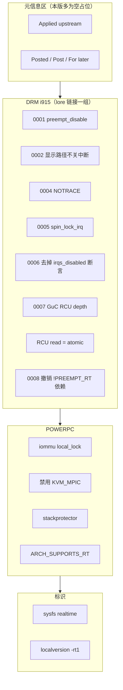
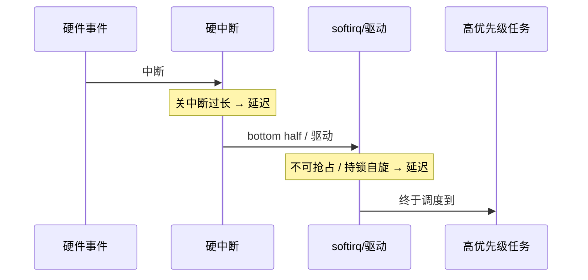
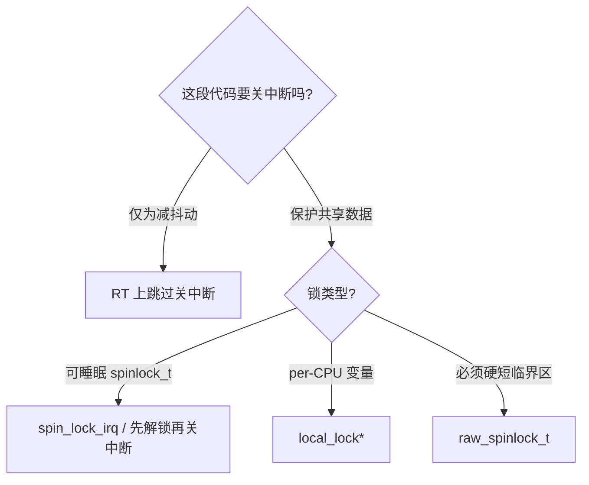
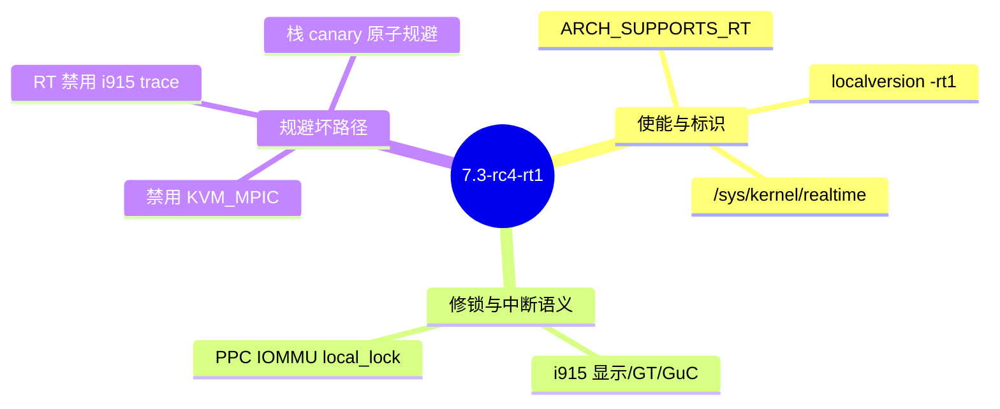
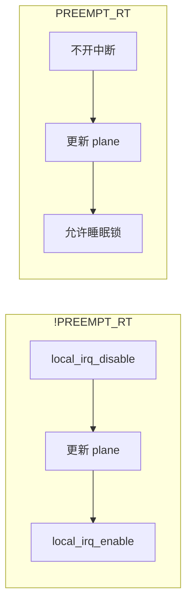
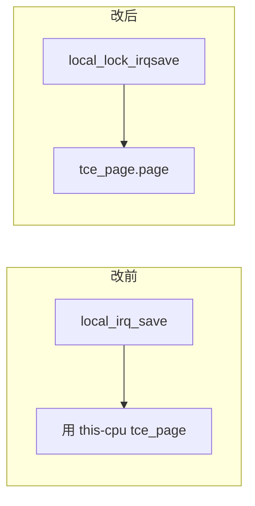

# Linux PREEMPT_RT Patch 详细代码讲解

> 版本基准：**7.3-rc4-rt1**（2026-09-26 拉取）  
> 精简版见 [RT_PATCH_EXPLAINED.md](RT_PATCH_EXPLAINED.md)；地址见 [RT_PATCH_SOURCE.md](RT_PATCH_SOURCE.md)  
> 本文：**先目录 → 再机制 → 再按 series 逐文件对照代码讲功能**

---

## 目录

1. [本仓库与官方 Patch 目录](#1-本仓库与官方-patch-目录)
2. [RT 要解决什么问题](#2-rt-要解决什么问题)
3. [主线 PREEMPT_RT 核心（读本补丁的前提）](#3-主线-preempt_rt-核心读本补丁的前提)
4. [本版残留补丁在做什么](#4-本版残留补丁在做什么)
5. [按 series 逐文件：代码 → 功能](#5-按-series-逐文件代码--功能)
6. [合并补丁触及的内核文件总表](#6-合并补丁触及的内核文件总表)
7. [应用与验证](#7-应用与验证)
8. [术语速查](#8-术语速查)

---

## 1. 本仓库与官方 Patch 目录

### 1.1 官方发布布局（kernel.org）

```
https://cdn.kernel.org/pub/linux/kernel/projects/rt/
├── 7.3/                          ← 大版本目录（与主线 major 对齐）
│   ├── patch-7.3-rc4-rt1.patch.xz      ← 合并后的单文件补丁（打源码用）
│   ├── patch-7.3-rc4-rt1.patch.sign    ← 签名
│   ├── patches-7.3-rc4-rt1.tar.xz      ← 拆分 series（阅读/维护用）
│   ├── sha256sums.asc
│   ├── incr/                     ← 增量补丁
│   └── older/                    ← 历史 rt 版本
├── 7.2/
├── 6.12/                         ← LTS 常用
└── ...
```

| 产物 | 用途 |
|------|------|
| `patch-VERSION-rtN.patch.xz` | 对**对应主线标签**一次 `patch -p1` |
| `patches-VERSION-rtN.tar.xz` | 内含 `series` + 多个小 `.patch`，便于审查与 quilt |
| `*.sign` / `sha256sums.asc` | 完整性校验 |

**本版对应主线：** `v7.3-rc4` + 后缀 `-rt1`。

### 1.2 本仓库目录（阅读入口）

```
rt-patch/
├── RT_PATCH_URL.md                 # 下载地址速查
├── docs/
│   ├── RT_PATCH_SOURCE.md          # 官方地址详表
│   ├── RT_PATCH_EXPLAINED.md       # 精简讲解
│   └── RT_PATCH_DETAILED.md        # 本文：详细代码讲解
├── patches/
│   ├── patch-7.3-rc4-rt1.patch.xz  # 合并补丁
│   ├── patch-7.3-rc4-rt1.patch.sign
│   ├── patches-7.3-rc4-rt1.tar.xz  # 官方 series 包
│   ├── sha256sums.asc
│   └── series/                     # 已展开，按官方顺序阅读
│       ├── series                  # 应用顺序清单
│       ├── 0001-... ~ 0008-...     # DRM/i915
│       ├── drm-i915-Consider-RCU-...
│       ├── POWERPC__... / powerpc_*
│       ├── sysfs__Add__sys_kernel_realtime_entry.patch
│       └── Add_localversion_for_-RT_release.patch
└── STEPS.md / EXECUTION_LOG.md / LESSONS.md
```

### 1.3 `series` 文件：官方分组与应用顺序

`patches/series/series` 不是简单列表，而是 **quilt/RT 维护分组**：



**实际会打进内核的补丁（14 个）按 series 顺序：**

| # | 文件名 | 子系统 |
|---|--------|--------|
| 1 | `0001-drm-i915-Use-preempt_disable-enable_rt-where-recomme.patch` | i915 display |
| 2 | `0002-drm-i915-Don-t-disable-interrupts-on-PREEMPT_RT-duri.patch` | i915 display |
| 3 | `0004-drm-i915-Disable-tracing-points-on-PREEMPT_RT.patch` | i915 trace |
| 4 | `0005-drm-i915-gt-Use-spin_lock_irq-instead-of-local_irq_d.patch` | i915 GT |
| 5 | `0006-drm-i915-Drop-the-irqs_disabled-check.patch` | i915 request |
| 6 | `0007-drm-i915-guc-Consider-also-RCU-depth-in-busy-loop.patch` | i915 GuC |
| 7 | `drm-i915-Consider-RCU-read-section-as-atomic.patch` | i915 engine |
| 8 | `0008-Revert-drm-i915-Depend-on-PREEMPT_RT.patch` | i915 Kconfig |
| 9 | `powerpc_pseries_iommu__Use_a_locallock_instead_local_irq_save.patch` | PPC IOMMU |
| 10 | `powerpc_kvm__Disable_in-kernel_MPIC_emulation_for_PREEMPT_RT.patch` | PPC KVM |
| 11 | `powerpc_stackprotector__work_around_stack-guard_init_from_atomic.patch` | PPC |
| 12 | `POWERPC__Allow_to_enable_RT.patch` | PPC Kconfig |
| 13 | `sysfs__Add__sys_kernel_realtime_entry.patch` | kernel |
| 14 | `Add_localversion_for_-RT_release.patch` | 版本后缀 |

> 编号跳过 `0003`：历史上有补丁被合入主线或废弃，series 保留原编号习惯。

### 1.4 两种产物的关系


- **学功能 / 写文档**：读 `patches/series/`（有 Subject、动机、单点 diff）。  
- **编内核**：用合并包 `patch-7.3-rc4-rt1.patch.xz` 即可。

---

## 2. RT 要解决什么问题

### 2.1 延迟从哪里来

实时场景关心的不是“平均快”，而是 **最坏情况调度延迟（worst-case latency）**：

从“事件发生”到“高优先级任务开始跑”，中间经过：关中断窗口、不可抢占内核段、软中断、持锁自旋、优先级反转等。



### 2.2 PREEMPT_RT 的对策（功能面）

| 手段 | 效果 |
|------|------|
| 内核几乎全程可抢占 | 高优先级可打断内核路径 |
| `spinlock_t` → 可睡眠锁 | 持锁可调度，减少“自旋霸占 CPU” |
| 保留 `raw_spinlock_t` | 真正短硬临界区 |
| IRQ / softirq 线程化 | 用优先级管理中断负载 |
| 优先级继承 | 缓解优先级反转 |

**≥6.12：上述核心已在主线。**  
`projects/rt/` 上的本版补丁 ≈ **尚未完全适配的驱动/架构收尾 + 版本标识**。

---

## 3. 主线 PREEMPT_RT 核心（读本补丁的前提）

本版每一处 diff，几乎都服从同一条规则：

> **在 PREEMPT_RT 上，`spinlock_t` 可能睡眠。**  
> **禁止在：关中断、关抢占、硬中断、RCU read-side 等“不可睡眠上下文”里获取可睡眠锁。**

### 3.1 传统写法为何炸

```c
local_irq_disable();
spin_lock(&lock);   /* 非 RT：忙等；RT：可能 schedule → 非法 */
...
spin_unlock(&lock);
local_irq_enable();
```

非 RT：`spin_lock` 不睡眠，关中断只是防死锁/并发。  
RT：`spin_lock` 可变睡眠 → **关中断后再锁 = scheduling while atomic**。

### 3.2 合法改造模式（本补丁全在用）

| 模式 | 做法 | 本补丁出现位置 |
|------|------|----------------|
| A. 干脆别关中断 | `if (!PREEMPT_RT) local_irq_disable()` | i915 crtc/cursor/vblank evade |
| B. 用 `_irq` 锁 API | `spin_lock_irq` / `spin_lock_irqsave` | i915 execlists、vblank section |
| C. per-CPU 用 `local_lock` | 替代“关中断保护 this-cpu 变量” | pseries iommu |
| D. 显式短关抢占 | `preempt_disable()` 盖住寄存器采样 | i915 scanoutpos |
| E. 原子判定补 RCU | `\|\| rcu_preempt_depth()` | GuC busy loop、stop_timeout |
| F. 禁用不兼容路径 | Kconfig `depends on !PREEMPT_RT` | KVM_MPIC；曾对 i915 |
| G. 关掉危险 trace | `#define NOTRACE` | i915 三个 trace 头文件 |



---

## 4. 本版残留补丁在做什么



**不做什么：** 不实现完整 RT 调度器；不替代主线 `CONFIG_PREEMPT_RT=y`。  
**做什么：** 让 **i915 / PowerPC** 在 RT 规则下可配置、可运行、不触发睡眠锁违规；并带上 `-rtN` 标识。

---

## 5. 按 series 逐文件：代码 → 功能

以下路径均相对于 **打补丁后的 Linux 源码树**；本地可对照 `patches/series/<文件>`。

---

### 5.1 `0001` — scanout 时序：锁语义对齐 + RT 显式关抢占

**文件：** `drivers/gpu/drm/i915/display/intel_vblank.c`  
**问题：** 主线用 `local_irq_save` + `spin_lock(uncore->lock)`。RT 上 `spinlock_t` **不再隐含关中断/关抢占**，寄存器采样窗口可被抢占，时间戳抖动；且 “irqsave + 另锁” 与 RT 锁模型不匹配。

**改法：**

1. 新增 `intel_vblank_section_enter_irqf` / `exit_irqf`：内部用 `spin_lock_irqsave(&uncore->lock, *flags)`，一把锁同时表达“锁 + 中断状态”。  
2. 在 `i915_get_crtc_scanoutpos()` 中，RT 下对 **纯寄存器读写段** 加 `preempt_disable()` / `preempt_enable()`。

```c
/* 替代: local_irq_save + intel_vblank_section_enter */
intel_vblank_section_enter_irqf(display, &irqflags);

if (IS_ENABLED(CONFIG_PREEMPT_RT))
	preempt_disable();

/* Get optional system timestamp / 读 scanout 寄存器 —— 不得阻塞 */
...

if (IS_ENABLED(CONFIG_PREEMPT_RT))
	preempt_enable();

intel_vblank_section_exit_irqf(display, irqflags);
```

`intel_get_crtc_scanline()` 同样改为 `_irqf` 封装。

**功能结论：** 保证“读扫描线位置 / 时间戳”在 RT 上仍是 **短、不可抢占的 timing-critical 段**，同时用正确的 irqsave 自旋锁 API，避免非法睡眠。

**风险备注（补丁原话）：** `__intel_get_crtc_scanline()` 最坏可约 100µs；属已知折中。

---

### 5.2 `0002` — 原子更新：RT 上不要关中断

**文件：** `intel_crtc.c`、`intel_cursor.c`、`intel_vblank.c`（evade 循环）

**问题：** `drm/i915: Make sprite updates atomic` 之后，原子更新路径用 `local_irq_disable()` 包住一大段。段内会：

- `prepare_to_wait` / `finish_wait`
- `drm_crtc_vblank_put` → `vbl_lock`
- plane 更新 → `intel_uncore::lock`
- `drm_crtc_arm_vblank_event` → `event_lock` / `vblank_time_lock`

这些都是 **`spinlock_t`（RT 可睡眠）**。关中断后再拿 → 直接违例。

补丁说明写得很清楚：关中断是为了 **避免随机延迟，不是同步所必需**。

**改法：**

```c
if (!IS_ENABLED(CONFIG_PREEMPT_RT))
	local_irq_disable();
/* ... pipe update / cursor update ... */
if (!IS_ENABLED(CONFIG_PREEMPT_RT))
	local_irq_enable();
```

`intel_vblank_evade()` 里 `schedule_timeout` 前后的 enable/disable 同样加 RT 条件。

**功能结论：** RT 显示更新路径保持开中断，允许段内可睡眠锁；非 RT 行为不变。



---

### 5.3 `0004` — RT 上关闭 i915 tracepoint

**文件：**

- `drivers/gpu/drm/i915/i915_trace.h`
- `drivers/gpu/drm/i915/display/intel_display_trace.h`
- `drivers/gpu/drm/i915/intel_uncore_trace.h`

**问题（真实 splat）：**

```
BUG: scheduling while atomic
  rt_spin_lock
  gen6_read32
  g4x_get_vblank_counter
  trace_event_raw_event_i915_pipe_update_start
```

tracepoint **求参数时** 可能读寄存器 → 拿 `spinlock_t`；而 trace 基础设施常在 **关抢占** 上下文 → RT 非法。

**改法：**

```c
#if defined(CONFIG_PREEMPT_RT) && !defined(NOTRACE)
#define NOTRACE
#endif
```

`NOTRACE` 使这些头文件里的 trace 宏变为空操作。

**功能结论：** 牺牲 RT 上 i915 的 ftrace 事件，换取正确性。属工程折中，不是性能优化。

---

### 5.4 `0005` — execlists：`local_irq_disable`+`spin_lock` 换成 `spin_lock_irq`

**文件：** `drivers/gpu/drm/i915/gt/intel_execlists_submission.c`

**问题：** 旧结构：

```c
static void execlists_dequeue_irq(struct intel_engine_cs *engine)
{
	local_irq_disable();
	execlists_dequeue(engine);  /* 内部 spin_lock(&sched_engine->lock) */
	local_irq_enable();
}
```

非 RT：关中断后 `spin_lock` ≈ `spin_lock_irq`。  
RT：**两者不等价**——外层关中断 + 内层可睡眠锁 = 违规。

**改法：**

```c
spin_lock_irq(&sched_engine->lock);
/* ... dequeue 逻辑 ... */
spin_unlock_irq(&sched_engine->lock);
```

删除 `execlists_dequeue_irq()`；tasklet 直接调 `execlists_dequeue()`。

**功能结论：** 提交队列锁的中断禁用与锁获取绑定在同一 API，RT/非 RT 语义一致。

**细微行为差：** 原 wrapper 在整个 dequeue（含解锁后尾巴）期间关中断；现仅在持锁区间关中断。补丁作者注明解锁后段是否再碰锁已检查过。

---

### 5.5 `0006` — 去掉 `GEM_BUG_ON(!irqs_disabled())`

**文件：** `drivers/gpu/drm/i915/i915_request.c`  
**函数：** `__i915_request_submit` / `__i915_request_unsubmit`

**问题：** 断言“中断必须关着”。RT 上持有已变成睡眠锁的 `sched_engine->lock` 时，**中断可以仍是开的**，断言误杀。

**改法：** 删除两处 `GEM_BUG_ON(!irqs_disabled())`，保留 `lockdep_assert_held(...)`。

**功能结论：** 用 lockdep 检查“是否持锁”，不再用“中断是否关闭”当代理条件。

---

### 5.6 `0007` — GuC busy loop：原子判定加上 RCU depth

**文件：** `drivers/gpu/drm/i915/gt/uc/intel_guc.h`  
**函数：** `intel_guc_send_busy_loop()`

**问题：** 用 `!in_atomic() && !irqs_disabled()` 判断“可以睡眠等待”。  
RT 上若已持有可睡眠 `spinlock_t`，会进入 **RCU read-side**，但前两个检查仍为 false → 函数去 `sleep` → **RCU splat**。

**改法：**

```c
bool not_atomic = !in_atomic() && !irqs_disabled() && !rcu_preempt_depth();
```

`not_atomic == false` 时走忙等，不调度。

**功能结论：** 在“持 RT 睡眠锁”的上下文中，GuC 发送等待改为自旋，避免在 RCU read-side 睡眠。

---

### 5.7 `drm-i915-Consider-RCU-read-section-as-atomic` — `stop_timeout`

**文件：** `drivers/gpu/drm/i915/gt/intel_engine_cs.c`

与 0007 同一根因，作用点不同：引擎 stop 路径若可睡就 `schedule_timeout`，原子上下文必须返回 0（立即结束等待）。

```c
if (in_atomic() || irqs_disabled() || rcu_preempt_depth())
	return 0;
```

**功能结论：** RT 持锁（隐含 RCU read）时，stop 不等待，防止非法睡眠。

```mermaid
flowchart TD
  T[需要等待引擎停?]
  T --> C{in_atomic | irqs_disabled | rcu_preempt_depth?}
  C -->|是| Z[timeout=0 忙等/立刻返回]
  C -->|否| S[可以 schedule_timeout]
```

---

### 5.8 `0008` — 撤销 `depends on !PREEMPT_RT`

**文件：** `drivers/gpu/drm/i915/Kconfig`

```diff
 config DRM_I915
 	depends on DRM
 	depends on X86 && PCI
-	depends on !PREEMPT_RT
```

**功能结论：** 前面 0001–0007 + RCU 补丁解决已知问题后，**允许在 PREEMPT_RT 内核中编译/启用 i915**。这是整组 DRM 补丁的“开门”补丁，应放在系列末尾。

---

### 5.9 PowerPC IOMMU — `local_lock` 保护 per-CPU `tce_page`

**文件：** `arch/powerpc/platforms/pseries/iommu.c`  
**函数：** `tce_buildmulti_pSeriesLP`、`tce_setrange_multi_pSeriesLP`

**原模型：**

```c
static DEFINE_PER_CPU(__be64 *, tce_page);
local_irq_save(flags);   /* 或 local_irq_disable */
tcep = __this_cpu_read(tce_page);
if (!tcep) {
	tcep = (__be64 *)__get_free_page(GFP_ATOMIC);
	__this_cpu_write(tce_page, tcep);
}
...
local_irq_restore(flags);
```

意图：保护 **本 CPU 的临时 TCE 页指针**。手段却是粗暴关中断；且临界区内分配内存。

**RT 模型：**

```c
struct tce_page {
	__be64 *page;
	local_lock_t lock;
};
static DEFINE_PER_CPU(struct tce_page, tce_page) = {
	.lock = INIT_LOCAL_LOCK(lock),
};

local_lock_irqsave(&tce_page.lock, flags);
tcep = __this_cpu_read(tce_page.page);
...
local_unlock_irqrestore(&tce_page.lock, flags);
```

**功能结论：**

- 保护范围精确到 **per-CPU 对象**（`local_lock` 本意）。  
- 在 RT 上与“可睡眠锁 / 中断线程化”模型兼容，避免用全局关中断冒充 per-CPU 互斥。



---

### 5.10 PowerPC KVM — 禁用 in-kernel MPIC 仿真

**文件：** `arch/powerpc/kvm/Kconfig`

```kconfig
config KVM_MPIC
	bool "KVM in-kernel MPIC emulation"
	depends on KVM && PPC_E500
	depends on !PREEMPT_RT
```

**原因（延迟 / DoS，不是简单编译错误）：**

directed delivery + 多 CPU mask 时，仿真持 **raw_lock** 遍历全部 VCPU，再对每个 VCPU 遍历 pending IRQ。期间主机 **关中断且不可抢占**。恶意 guest 可把循环撑大 → 主机实时延迟崩溃。

**功能结论：** RT 主机上禁用该仿真路径，逼使用户改用更安全的中断注入方式或硬件 MPIC 场景约束。属 **明确的实时安全策略**。

---

### 5.11 PowerPC stackprotector — 原子上下文初始化 canary

**文件：** `arch/powerpc/include/asm/stackprotector.h`  
**函数：** `boot_init_stack_canary()`

从核启动路径在 **原子上下文** 调用。RT 上 `get_random_canary()` 可能涉及不能在该上下文使用的路径。

```c
#ifndef CONFIG_PREEMPT_RT
	canary = get_random_canary();
#else
	canary = ((unsigned long)&canary) & CANARY_MASK;
#endif
```

**功能结论：** RT 上用栈地址派生初始 canary（后续仍可有架构侧混合），避免从核启动踩睡眠/阻塞路径。x86 侧类比是用 TSC 等。

---

### 5.12 `POWERPC__Allow_to_enable_RT` — 打开架构 RT 开关

**文件：** `arch/powerpc/Kconfig`

```kconfig
select ARCH_SUPPORTS_RT  if HAVE_POSIX_CPU_TIMERS_TASK_WORK
```

**功能结论：** 无 `ARCH_SUPPORTS_RT` 后，menuconfig 才能选 `CONFIG_PREEMPT_RT`。  
条件 `HAVE_POSIX_CPU_TIMERS_TASK_WORK`：RT 依赖的 posix cpu timer 以 task_work 方式处理，架构需具备该能力。

---

### 5.13 sysfs — `/sys/kernel/realtime`

**文件：** `kernel/ksysfs.c`

```c
#if defined(CONFIG_PREEMPT_RT)
static ssize_t realtime_show(struct kobject *kobj,
			     struct kobj_attribute *attr, char *buf)
{
	return sprintf(buf, "%d\n", 1);
}
KERNEL_ATTR_RO(realtime);
#endif
```

挂到 `kernel_attrs[]`，节点：`/sys/kernel/realtime`。

**功能结论：** 用户态（尤其 udev）快速判断“是否 RT 内核”，避免成千上万次解析 `uname -v`。仅在 `CONFIG_PREEMPT_RT` 时存在且恒为 `1`。

---

### 5.14 `localversion-rt` — uname 后缀

**新文件：** 源码树根目录 `localversion-rt`

```
-rt1
```

内核构建系统会把 `localversion*` 拼进 `UTS_RELEASE`。

**功能结论：** `uname -r` 形如 `7.3.0-rc4-rt1`，与官方 RT 发布编号一致，便于发行版与测试矩阵对齐。

---

## 6. 合并补丁触及的内核文件总表

| 内核路径 | 来自哪些 series 补丁 | 功能一句话 |
|----------|----------------------|------------|
| `localversion-rt` | Add_localversion | 版本后缀 `-rt1` |
| `kernel/ksysfs.c` | sysfs realtime | `/sys/kernel/realtime` |
| `arch/powerpc/Kconfig` | Allow_to_enable_RT | `ARCH_SUPPORTS_RT` |
| `arch/powerpc/include/asm/stackprotector.h` | stackprotector | 原子 canary |
| `arch/powerpc/kvm/Kconfig` | kvm MPIC | RT 禁用 MPIC 仿真 |
| `arch/powerpc/platforms/pseries/iommu.c` | iommu locallock | per-CPU local_lock |
| `drivers/gpu/drm/i915/Kconfig` | 0008 | 允许 RT 选 i915 |
| `.../display/intel_crtc.c` | 0002 | 原子更新不关中断 |
| `.../display/intel_cursor.c` | 0002 | 光标更新不关中断 |
| `.../display/intel_vblank.c` | 0001, 0002 | scanout 临界区 + evade |
| `.../display/intel_display_trace.h` | 0004 | NOTRACE |
| `.../i915_trace.h` | 0004 | NOTRACE |
| `.../intel_uncore_trace.h` | 0004 | NOTRACE |
| `.../gt/intel_execlists_submission.c` | 0005 | spin_lock_irq |
| `.../i915_request.c` | 0006 | 删 irqs_disabled 断言 |
| `.../gt/uc/intel_guc.h` | 0007 | RCU depth |
| `.../gt/intel_engine_cs.c` | RCU atomic | stop_timeout |

---

## 7. 应用与验证

### 7.1 应用合并补丁

```bash
# 主线树需匹配：v7.3-rc4
cd linux
xzcat /path/to/patch-7.3-rc4-rt1.patch.xz | patch -p1
# 或
xzcat ... | git apply
```

### 7.2 关键配置

```text
CONFIG_PREEMPT_RT=y
# PowerPC 还需架构已 select ARCH_SUPPORTS_RT（本补丁已做）
# x86_64 主线通常已支持 RT
```

### 7.3 运行时检查

```bash
uname -r                    # 应含 -rt1
cat /sys/kernel/realtime    # 应为 1
zcat /proc/config.gz | grep PREEMPT_RT
```

### 7.4 延迟验证（不在本补丁内）

用 cyclictest / stress-ng 等（团队若有 `rt-test` 脚本规范，应走脚本而非手搓参数）。

---

## 8. 术语速查

| 术语 | 含义 |
|------|------|
| `CONFIG_PREEMPT_RT` | 完全抢占实时内核选项（主线） |
| `spinlock_t` | 非 RT 自旋；RT 上多为可睡眠锁 |
| `raw_spinlock_t` | 始终真正自旋的硬锁 |
| `local_lock` | per-CPU 锁；RT 上替代“关中断保护 this-cpu” |
| `rcu_preempt_depth()` | 是否处于 RCU read-side；RT 持睡眠锁时常 >0 |
| threaded IRQ | 中断线程化，可设优先级 |
| worst-case latency | 最坏调度延迟，RT 优化目标 |
| OOT patch | out-of-tree，未（完全）合主线的补丁包 |

---

## 9. 总结

| 问题 | 答案 |
|------|------|
| 目录怎么读？ | 先官方 `projects/rt/<ver>/`，再本仓 `patches/` + `patches/series/series` |
| RT 功能本体在哪？ | 主线 `PREEMPT_RT`，不在这 500 行里 |
| 本补丁代码在干什么？ | **按 RT 锁规则改造 i915/PPC，并打上 rt 标识** |
| 贯穿原则？ | 不可睡眠上下文禁止拿可睡眠锁；短硬临界区用 raw/local_lock/preempt_disable |

**阅读建议：** 先本文 §1 摸清目录 → §3 吃透规则 → §5 按 series 顺序对着 `patches/series/*.patch` 看 diff。精简回顾用 [RT_PATCH_EXPLAINED.md](RT_PATCH_EXPLAINED.md)。
