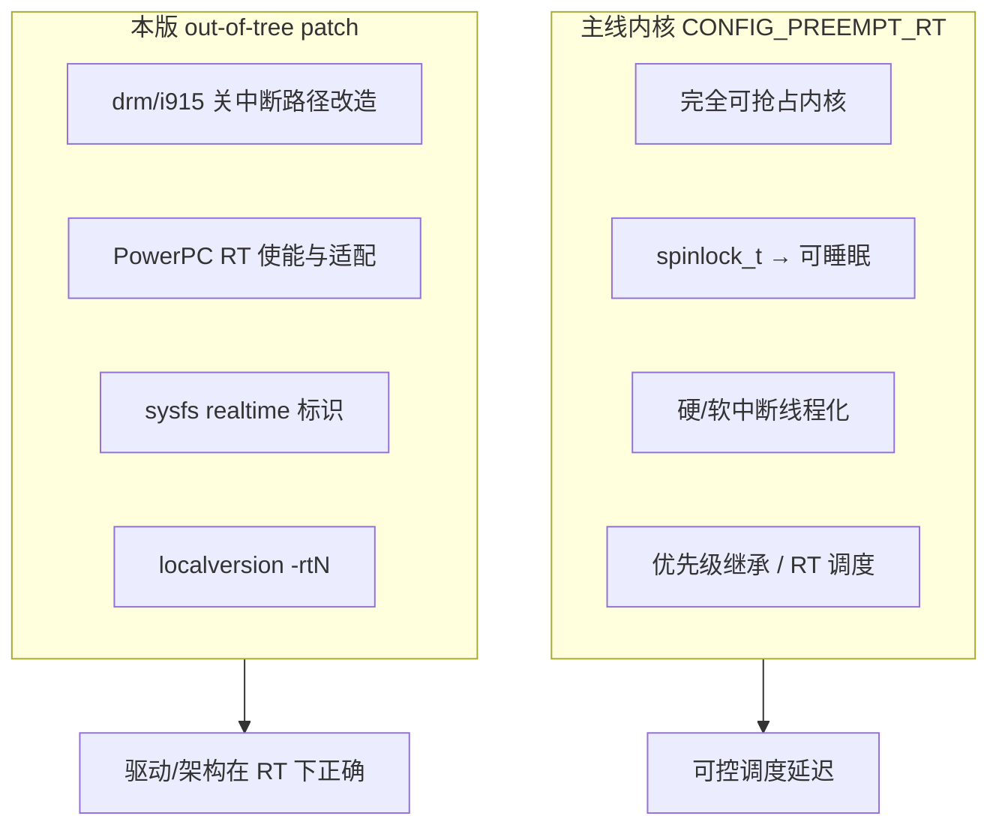
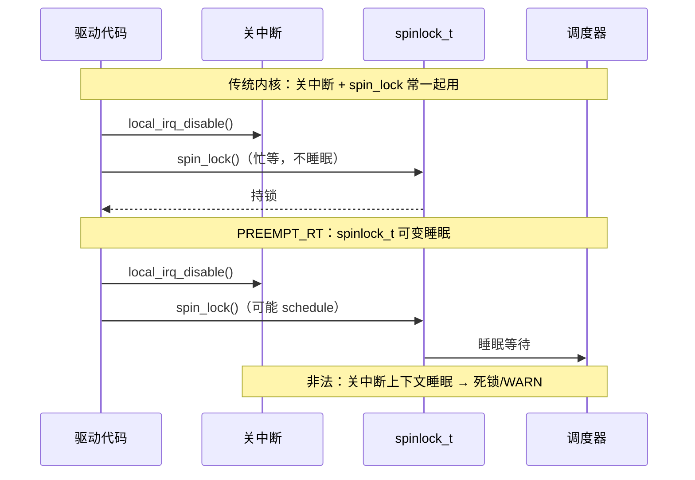
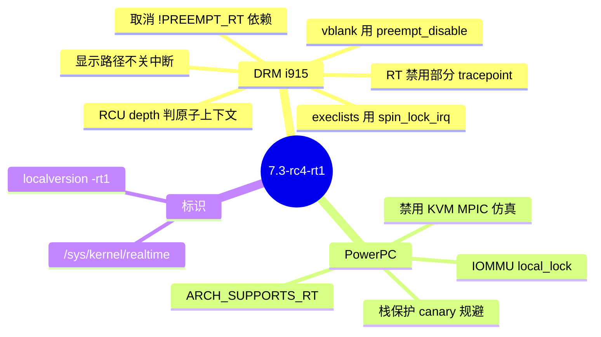
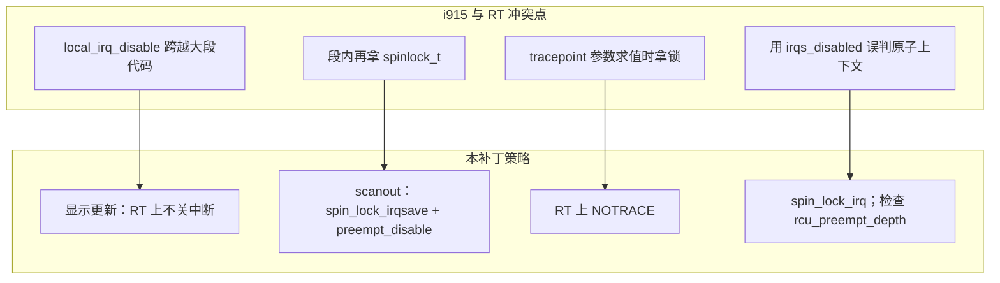
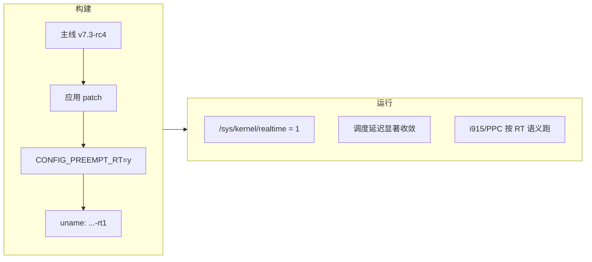

# Linux PREEMPT_RT Patch 功能讲解

> 基于官方补丁 **7.3-rc4-rt1**（见 `RT_PATCH_URL.md`）  
> 结构：总体目标 → 核心机制（已主线）→ 本版残留补丁（结合代码）  
> **更详细（目录 + 逐文件代码）**见 [RT_PATCH_DETAILED.md](RT_PATCH_DETAILED.md)

---

## 1. 一句话定位

**PREEMPT_RT 的目标：把 Linux 变成可抢占的实时内核，让高优先级任务的最坏情况调度延迟可控。**

普通内核：内核态大段不可抢占 + 关中断保护临界区 → 延迟毛刺大。  
RT 内核：尽量让“关中断 / 关抢占”的窗口变短，把同步原语改成可睡眠、可抢占，硬实时路径可被更高优先级任务打断。


---

## 2. 总体架构（由浅入深）

### 2.1 历史与现状

| 阶段 | 含义 |
|------|------|
| 早期 | 整套 RT 以 **out-of-tree patch** 形式维护（数千～上万行） |
| 持续合入 | 线程化中断、可睡眠锁、强制线程化等逐步进主线 |
| **≥ 6.12** | `CONFIG_PREEMPT_RT` **核心已进主线**；`projects/rt/` 上只剩少量驱动/架构适配 |
| **本版 7.3-rc4-rt1** | 仅约 **511 行**，主要是 **i915 + PowerPC 适配 + 标识** |

因此讲解要分两层：

1. **RT 功能本体**（主线里的 `PREEMPT_RT`）——真正决定实时性。  
2. **本版 patch**——让尚未完全适配的子系统在 RT 上不破坏锁语义。



### 2.2 功能清单（RT 实际提供什么）

| 能力 | 作用 |
|------|------|
| 完全抢占 | 除极少 raw 临界区外，内核路径可被抢占 |
| 可睡眠自旋锁 | `spinlock_t` 在 RT 上变为 rt_mutex 类，持锁期间可调度 |
| `raw_spinlock_t` | 真正的“不可睡眠、短临界区”硬锁，留给硬件/底层 |
| 中断线程化 | 多数 IRQ 在线程上下文处理，可用优先级管理 |
| 软中断线程化 | 减少 softirq 对实时任务的干扰 |
| 优先级继承 | 避免优先级反转 |
| 更短的关中断窗口 | 降低最坏延迟 |

---

## 3. 核心机制（主线 RT，理解本补丁的前提）

本版补丁几乎全是在处理同一条规则：

> **RT 上：`spinlock_t` 可睡眠；禁止在“关中断 / 关抢占 / 原子上下文”里拿可睡眠锁。**



因此驱动要么：

- **RT 上不再关中断**（若关中断只是“减抖动”而非同步）；或  
- 改用 **`spin_lock_irq()` / `local_lock`**，让锁与中断状态语义一致；或  
- 真正硬临界区改用 **`raw_spinlock_t`**。

本版 i915 / PowerPC 改动，全部围绕这一点。

---

## 4. 本版补丁总览（7.3-rc4-rt1）

官方拆分为 `patches-*.tar.xz` 系列，合并后即单文件 `patch-*.patch.xz`。



| 类别 | 文件数/触点 | 目的 |
|------|-------------|------|
| drm/i915 | 显示、GT、GuC、trace、Kconfig | 在 RT 上可编译、可运行且不踩睡眠锁 |
| arch/powerpc | Kconfig、iommu、stackprotector、kvm | 允许选 RT + 修原子上下文问题 |
| kernel/ksysfs.c | realtime 属性 | 用户态识别 RT 内核 |
| localversion-rt | `-rt1` | uname 版本后缀 |

---

## 5. 模块精讲（结合代码）

### 5.1 标识层：这是不是 RT 内核？

**`localversion-rt`** → uname 带 `-rt1`。

**`kernel/ksysfs.c`**：RT 时导出只读属性，读出来恒为 `1`：

```c
#if defined(CONFIG_PREEMPT_RT)
static ssize_t realtime_show(...)
{
	return sprintf(buf, "%d\n", 1);
}
KERNEL_ATTR_RO(realtime);
#endif
```

用途：udev/脚本用 `/sys/kernel/realtime` 判断，避免反复解析 `uname`。

---

### 5.2 PowerPC：使能 RT + 修原子路径

#### （1）允许架构选择 RT

```c
select ARCH_SUPPORTS_RT  if HAVE_POSIX_CPU_TIMERS_TASK_WORK
```

无 `ARCH_SUPPORTS_RT` 后，Kconfig 才能选 `PREEMPT_RT`。

#### （2）栈 canary：热径不能调可能睡眠的随机数

从核启动在原子上下文调 `boot_init_stack_canary()`；RT 上 `get_random_canary()` 可能不适配，改为用栈地址派生初始值：

```c
#ifndef CONFIG_PREEMPT_RT
	canary = get_random_canary();
#else
	canary = ((unsigned long)&canary) & CANARY_MASK;
#endif
```

#### （3）pseries IOMMU：`local_irq_*` → `local_lock`

原逻辑用关中断保护 **per-CPU `tce_page`**，却在临界区内 `GFP_ATOMIC` 分配。RT 上应使用 **`local_lock`**（per-CPU 锁，语义与“仅保护本 CPU 变量”一致）：

```c
struct tce_page {
	__be64 *page;
	local_lock_t lock;
};
static DEFINE_PER_CPU(struct tce_page, tce_page) = {
	.lock = INIT_LOCAL_LOCK(lock),
};

local_lock_irqsave(&tce_page.lock, flags);
/* 使用/分配 tce_page.page */
local_unlock_irqrestore(&tce_page.lock, flags);
```

要点：**保护对象是 per-CPU 页指针，不是“整机必须关中断”**。

#### （4）KVM MPIC：RT 上直接禁用

```c
config KVM_MPIC
	depends on !PREEMPT_RT
```

原因：仿真里在 **raw 锁** 下对大量 VCPU/中断做嵌套循环，关抢占时间过长，恶意 guest 可拉高主机延迟。属安全/延迟权衡，非简单 bugfix。

---

### 5.3 drm/i915：本补丁最大块

主线曾用 `depends on !PREEMPT_RT` 直接禁掉 i915。本系列改完后 **Revert 该依赖**，使 RT 可启用 Intel 显卡驱动。



#### （1）显示管线：关中断改为 RT 旁路

`intel_crtc.c` / `intel_cursor.c` / `intel_vblank_evade`：

```c
if (!IS_ENABLED(CONFIG_PREEMPT_RT))
	local_irq_disable();
/* ... 更新 plane / 避让 vblank ... */
if (!IS_ENABLED(CONFIG_PREEMPT_RT))
	local_irq_enable();
```

注释意图：关中断是为 **减少随机延迟**，不是锁同步。RT 上关中断后若再拿可睡眠 `spinlock_t` 会炸，故 RT 路径保持开中断。

#### （2）读 scanout 位置：用正确的“短临界区”

`intel_vblank.c`：

- 非 RT：`local_irq_save` + uncore 自旋锁。  
- RT：封装为 `intel_vblank_section_enter_irqf()` → 内部 `spin_lock_irqsave`；另对寄存器采样段加 `preempt_disable()`。

```c
intel_vblank_section_enter_irqf(display, &irqflags);
if (IS_ENABLED(CONFIG_PREEMPT_RT))
	preempt_disable();
/* 读寄存器 / 时间戳 —— 不得阻塞 */
if (IS_ENABLED(CONFIG_PREEMPT_RT))
	preempt_enable();
intel_vblank_section_exit_irqf(display, irqflags);
```

对应系列补丁标题中的 *Use preempt_disable/enable where recommended*：在 RT 上 uncore 锁 **不再隐含关抢占**，需显式 `preempt_disable` 盖住 timing-critical 寄存器访问。

#### （3）GT execlists：合并“关中断 + spin_lock”

原模式：

```text
execlists_dequeue_irq():
  local_irq_disable();
  execlists_dequeue();   // 内部 spin_lock()
  local_irq_enable();
```

RT 上 `local_irq_disable` + `spin_lock` **≠** `spin_lock_irq`。改为直接：

```c
spin_lock_irq(&sched_engine->lock);
/* dequeue */
spin_unlock_irq(&sched_engine->lock);
```

并删掉 `execlists_dequeue_irq()` 包装；提交路径去掉 `GEM_BUG_ON(!irqs_disabled())`（RT 持睡眠锁时中断可仍开着，lockdep 已能检查）。

#### （4）原子上下文判定补上 RCU depth

RT 上拿到 `spinlock_t` 会进入 **RCU read-side**，但 `in_atomic()` / `irqs_disabled()` 可能仍为假。若此时去 `schedule`，触发 RCU splat。

```c
/* GuC busy loop：决定自旋还是可睡 */
bool not_atomic = !in_atomic() && !irqs_disabled() && !rcu_preempt_depth();

/* engine stop_timeout：原子上下文则超时为 0，不睡 */
if (in_atomic() || irqs_disabled() || rcu_preempt_depth())
	return 0;
```

#### （5）RT 上关闭 i915 tracepoint

`i915_trace.h` / `intel_display_trace.h` / `intel_uncore_trace.h`：

```c
#if defined(CONFIG_PREEMPT_RT) && !defined(NOTRACE)
#define NOTRACE
#endif
```

原因：trace 参数求值时可能调用会拿 `spinlock_t` 的函数，而 trace 路径常处关抢占上下文 → RT 非法。折中：**RT 构建直接关掉这些 trace**。

#### （6）Kconfig：允许 RT 选 i915

删除 `depends on !PREEMPT_RT`，与上述修复配套。

---

## 6. 打补丁后系统行为（对照）



| 观察点 | 含义 |
|--------|------|
| `uname -r` 含 `-rt` | localversion |
| `cat /sys/kernel/realtime` → `1` | ksysfs 标识 |
| `CONFIG_PREEMPT_RT=y` | 核心实时能力（主线） |
| cyclictest 等 | 验证延迟；补丁本身不提供测试工具 |

---

## 7. 阅读代码的推荐顺序

1. 先建立心智模型：§2–§3（抢占 + 可睡眠锁）。  
2. 再读本补丁：`localversion` / `ksysfs`（标识）→ PowerPC（模式简单）→ **i915**（冲突全集中）。  
3. 对照系列目录 `patches/series` 中 DRM/POWERPC 分组与 lore 链接，便于向上游追状态。

---

## 8. 小结

| 层次 | 结论 |
|------|------|
| 功能本质 | 降低最坏调度延迟，使内核可硬实时调度 |
| 能力载体 | 主要在主线 `PREEMPT_RT`，不在这 4.7KB 补丁里 |
| 本版补丁职责 | **收尾适配**：i915 锁/中断模型、PowerPC 使能与原子路径、运行时标识 |
| 统一原则 | 不在关中断/原子上下文中使用可睡眠锁；短硬临界区用 raw/local_lock/preempt_disable |

**一句话收束：** 主线 RT 改“内核能不能实时”；本 patch 改“剩下几个子系统在 RT 规则下还能不能正确工作”。
