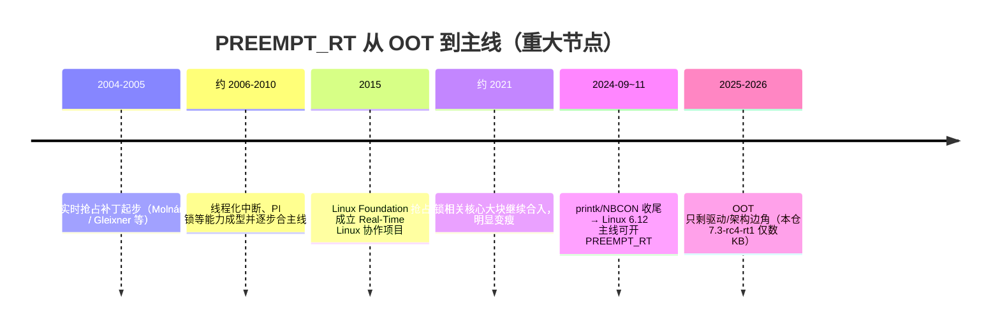
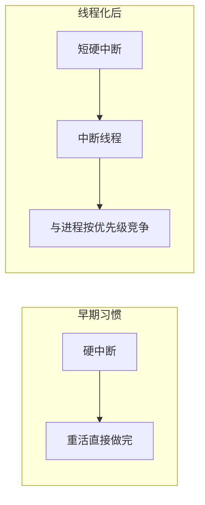
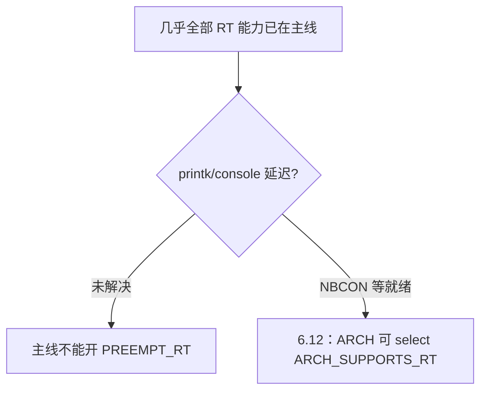
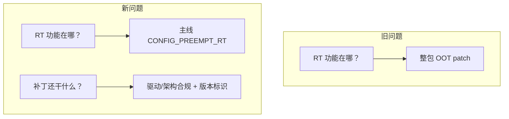

# RT Patch 历史里程碑：重大改动主题讲解

> 材料来源：`cdn.kernel.org/.../projects/rt/` 各版本补丁体积、`linux-stable-rt` / `linux-rt-devel` 标签与分支、公开合入记录（6.12 主线化等）。  
> 与原理文档配合：[RT简明.md](RT简明.md) · [RT详解.md](RT详解.md)

---

## 0. 先看一条时间线

**读历史时记住一件事：**  
“RT 补丁”从来不是一次写完的魔法；而是 **二十年间把内核改成可预期延迟**，并把成果一点点塞进主线。今天你下载的 `patch-*-rtN`，只是这条长河的**当前残留水位**。

---

## 1. OOT 体积在说什么（用官方包直接量）

同一站点各版本**最新正式** `patch-*.patch.xz` 压缩体积（检索日抽样）：

| 内核线 | 样例补丁 | 约体积 |
|--------|----------|--------|
| 4.19 | `…-rt140` | ~163 KB |
| 5.4 | `…-rt104` | ~178 KB |
| 5.10 | `…-rt164` | ~169 KB |
| 5.15 | `…-rt98` | ~79 KB |
| 6.1 | `…-rt68` | ~50 KB |
| 6.6 | `…-rt79` | ~86 KB |
| **6.12** | `…-rt20` | **~19 KB** |
| 7.0 | `…-rt2` | ~9 KB |
| 7.2 | `…-rt5` | ~10 KB |
| **7.3-rc4** | `…-rt1` | **~4.7 KB** |

**主题含义：** 体积下降 ≈ 功能已迁入主线。  
**6.12 是分水岭**：之后再谈“打 RT 补丁”，主体已是 **打开 `CONFIG_PREEMPT_RT`**，而不是吞下几百 KB 的巨型 diff。

---

## 2. 重大主题讲解（按意义，不按琐碎 commit）

下列每一条都是“改变 RT 是什么/怎么交付”的级别，值得单独当课讲。

---

### 主题 A：项目起源——把 Linux 改成可抢占实时内核（2004～）

| 项 | 内容 |
|----|------|
| **是什么** | Ingo Molnár、Thomas Gleixner 等启动实时抢占工作；长期以 **out-of-tree patch** + `-rt` 树维护 |
| **为何重大** | 定下目标：**压最坏调度延迟**，而不是再加一套独立 RTOS |
| **和今天的关系** | 你现在用的 `PREEMPT_RT` 名字、`-rtN` 发布节奏、stable-rt 树，都从这一阶段延续下来 |

**讲解抓手：** 非 RT 优化吞吐；RT 从第一天就优化 worst-case latency。

---

### 主题 B：中断线程化（Threaded IRQs）

| 项 | 内容 |
|----|------|
| **是什么** | 多数硬中断的重活放到 `irq/NNN-*` 内核线程，而不是全程在硬中断上下文跑 |
| **为何重大** | 中断负载可设优先级，高优先级实时任务能压过低优先级中断线程；硬中断入口变短 |
| **合入意义** | 很早进入主线后，**全体 Linux**（含非 RT）受益；是 RT “解构内核”的样板 |

**讲解抓手：** 没有线程化，后面的“可睡眠锁”很难落地（中断上下文不能睡）。

---

### 主题 C：锁模型重写——`spinlock_t` 可睡眠 vs `raw_spinlock_t`

| 项 | 内容 |
|----|------|
| **是什么** | RT 上普通 `spinlock_t` 变为可睡眠锁；真正短硬临界区留给 `raw_spinlock_t`；配合优先级继承（PI） |
| **为何重大** | 这是相对非 RT 的**规则级翻转**；几乎所有驱动适配（含本仓 i915）都在服从这条铁律 |
| **合入意义** | 锁/抢占核心多年分片合入主线；OOT 里同类改动逐年消失 |

**讲解抓手：** 见简明 §2——“关中断 + spinlock”在 RT 上为何非法。

---

### 主题 D：软中断与强制线程化路径

| 项 | 内容 |
|----|------|
| **是什么** | softirq 等“中断尾部工作”在 RT 上更倾向线程化，避免插在实时任务前无界拖时间 |
| **为何重大** | 解决“FIFO 优先级很高仍被网络 softirq 拖死”这类非 RT 典型抖动 |
| **讲解抓手** | 延迟来源不只 spinlock，还有 softirq 隐形队伍 |

---

### 主题 E：协作工程化——2015 Real-Time Linux（RTL）项目

| 项 | 内容 |
|----|------|
| **是什么** | Linux Foundation 下成立实时协作项目，集中资源把 RT **持续上游化**，而不是永远停在下游树 |
| **为何重大** | 从“爱好者/厂商下游补丁”变成有组织的主线合入战役；决定了今天 6.12 能落地 |
| **讲解抓手** | 技术难题 + 资金/维护组织，缺一不可 |

---

### 主题 F：抢占与锁核心大块合入（约 2021 前后）

| 项 | 内容 |
|----|------|
| **是什么** | 与 RT 抢占模型、锁实现相关的大块代码进一步进入主线（公开叙述中常作为 OOT 明显变瘦的阶段） |
| **为何重大** | 从“主线有零散 RT 特性”走向“主线几乎就是 RT 内核，只差最后开关” |
| **证据** | 上表里 5.10→5.15→6.1 OOT 体积台阶式下降 |

---

### 主题 G：最后的拦路虎——`printk` / 控制台（NBCON）

| 项 | 内容 |
|----|------|
| **是什么** | 传统 `printk`/console 锁路径会造成**无界延迟**；RT 不能在主线打开，直到控制台改为可抢占友好的 **NBCON** 等方案 |
| **为何重大** | 其它架构与子系统工作已就绪时，**卡在日志打印**；这是“二十年差点合完却合不完”的象征 |
| **结果** | printk 相关合入后，维护者声明：x86 / ARM64 / RISC-V 可无本质队列障碍地开启 RT |

**讲解抓手：** 实时不只看调度器，**任何无界临界区**（包括打印）都会毁 worst-case。

---

### 主题 H：Linux 6.12——主线可配置 `PREEMPT_RT`（2024）

| 项 | 内容 |
|----|------|
| **是什么** | 6.12 起，在支持架构上可直接 `CONFIG_PREEMPT_RT=y` 编出实时内核（选项仍属专家/非默认） |
| **为何重大** | **交付形态变了**：从“必须打巨型 OOT”变为“主线选项 + 小补丁” |
| **不是什么** | 不是默认全体变实时；吞吐与延迟仍是显式权衡 |

官方树仍发 `6.12.x-rtN` 等标签（如 `v6.12.100-rt20`），但 OOT 已是小适配包。

---

### 主题 I：后主线时代——OOT 变成“边角收尾”（6.12→7.3）

| 项 | 内容 |
|----|------|
| **是什么** | 残留补丁集中在：**未完全适配的驱动（如 i915）**、**部分架构使能/规避**、**`-rtN` / sysfs 标识** |
| **为何重大** | 学 RT 必须改提问方式：先学主线 `PREEMPT_RT` 规则，再看 OOT 在修哪条铁律 |
| **本仓实例** | `7.3-rc4-rt1` ≈ 4.7KB，详见 [RT详解.md](RT详解.md) |

---

## 3. 提交/发布记录怎么自己继续挖

| 来源 | 用途 |
|------|------|
| https://cdn.kernel.org/pub/linux/kernel/projects/rt/ | 各版本 `patch` / `patches` / `older` / `incr` |
| https://git.kernel.org/pub/scm/linux/kernel/git/rt/linux-stable-rt.git | stable 线 `-rt` 标签（如 `v6.12.100-rt20`） |
| https://git.kernel.org/pub/scm/linux/kernel/git/rt/linux-rt-devel.git | 开发树；`__about__` 分支说明项目入口 |
| LWN / Kernel Newbies 6.12 | 主线化叙事与 printk 收官 |

查某一版“还改了啥”：解压该版 `patches-*-rtN.tar.xz`，读 `series`——和本仓 `patches/series/` 同一读法。

---

## 4. 若只讲一堂课：建议主题顺序

1. **A 起源 + 目标**（为何要 RT）  
2. **B 中断线程化 + C 锁模型**（机制两根柱子）  
3. **G printk 最后一公里 + H 6.12 主线化**（历史高潮）  
4. **I 后主线 OOT / 本仓 7.3 补丁**（落到你正在用的包）  
5. （可选）**E 协作项目**——解释为何能撑二十年  

对应原理细节仍回 [RT简明.md](RT简明.md)；对应每一条 OOT diff 仍回 [RT详解.md](RT详解.md)。

---

## 5. 一句话收束

RT 的“历史提交”真正重大的不是某个驱动的一行 diff，而是：**线程化中断、可睡眠锁、无界路径清零（尤其 printk），直到 6.12 主线可开 `PREEMPT_RT`；此后官方 patch 进入收尾时代。**
