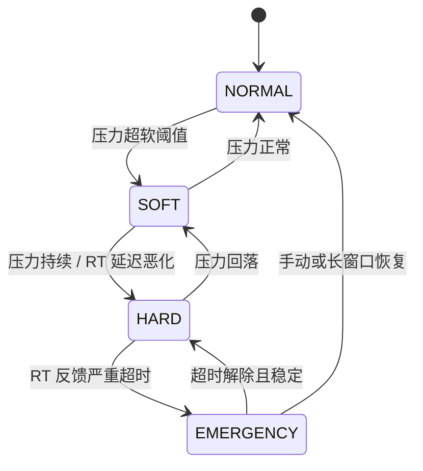

# 软件侧“快速切掉非隔离核资源占用”：算法研究

> 诉求澄清：不是再写一个 CPU 调度类，而是——**当需要保证隔离核实时性时，用软件尽快切断（或掐死）非隔离核对共享资源的消耗**。  
> 可牺牲非 RT 核性能。  
> 前篇：[RT隔离核与共享资源干扰.md](RT隔离核与共享资源干扰.md)

---

## 1. 问题重新表述（对准你想要的“算法”）

你要的其实是：

```text
检测干扰 / 进入护航窗口
    → 在毫秒级内压掉非 RT 的：CPU 执行、访存、占缓存、IO
    → 隔离核上的 RT 任务在共享资源上“突然变干净”
```

这在控制论里叫 **闭环资源护航（Resource Fencing Controller）**，不是 CFS/FIFO 那种 **任务调度算法**。

| | CPU 调度器 | 你要的算法 |
|--|------------|------------|
| 决策对象 | 哪个任务上 CPU | 非 RT 还许不许可吃共享资源 |
| 作用点 | runqueue | cgroup / resctrl / freeze / io 限速 |
| 解决不了 | LLC、DRAM 带宽 | （配合硬件 QoS 或 freeze）正是目标 |
| 已有近似 | FIFO/DEADLINE | **Intel mba_sc、cgroup 限速、freeze** |

**结论：** 可行；应做成 **“感知 → 决策 → 执行器”** 的护航控制器，而不是重写 `schedule()`。

---

## 2. 为何“快速切断”在软件上说得通

非 RT 核之所以伤害 RT 核，是因为它们在**持续产生**访存/填缓存/打 IO。  
软件只要在短时间内让非 RT：

1. **停止执行**（不再发新的访存），或  
2. **被硬件限住带宽/缓存路**（还能跑但打不动总线），  

共享资源压力就会掉下去。RT 核侧延迟毛刺通常随之收敛（收敛时间取决于缓存热身、队列排空，常见数 ms～数十 ms 量级，视负载而定）。


内核里已有同类思想：**MBA Software Controller（mba_sc）**——读 MBM 实测带宽，反馈调节 MBA 百分比，把带宽“钉”在目标 MBps（`mount -t resctrl -o mba_MBps ...`）。你要的是把它从“带宽闭环”推广到 **“护航 RT 的多执行器闭环”**。

---

## 3. 执行器盘点：谁能“快速切资源”（按速度与杀伤力）

### 3.1 速度与效果（工程排序）

| 优先级 | 执行器 | 切什么 | 典型时延 | 杀伤力 | 依赖 |
|--------|--------|--------|----------|--------|------|
| 1 | **resctrl MBA** 把非 RT 带宽打到最低档 | DRAM 带宽 | 写 sysfs 后硬件侧很快 | 高 | Intel RDT / 同类 |
| 2 | **resctrl CAT** 收回非 RT 的 L3 ways | LLC | 同上 | 高 | CAT |
| 3 | **cgroup.freeze=1** 冻结整个非 RT 组 | CPU→间接切断一切产生 | ms 级（要等线程进入冰箱） | **极高** | cgroup v2 |
| 4 | **cpu.max** 收到接近 0 | CPU 时间 | 一个周期内 | 高 | cgroup cpu |
| 5 | **io.max** 收到 0/极低 | 块 IO | 较快 | 中高 | cgroup io |
| 6 | **memory.high** 压低 | 内存扩张/逼 reclaim | 较慢，且 reclaim 本身可能抖 | 中 | 慎用 |

**没有硬件 QoS 时：** 最有效的“软件快刀”是 **`cgroup.freeze`（或把非 RT 的 cpu.max 打到几乎为 0）**——不让非 RT 跑，就不会继续污染 LLC、打满内存带宽。  
这正是“牺牲其他核”的极致形态。

### 3.2 freeze 为何往往比“降 nice”更符合你的目标

- nice/低优先级：非 RT 仍可能跑满空闲核 → **仍吃带宽和缓存**  
- freeze / cpu.max≈0：非 RT **停止发记忆体交易** → 共享资源侧才真正安静  

所以：你要的不是“调度上让 RT 更优先”，而是 **“非 RT 资源闸门瞬间关闭”**。

### 3.3 硬件 QoS 仍是上限决定因素

| 平台能力 | 软件能做到的天花板 |
|----------|-------------------|
| 有 CAT+MBA（或 ARM MPAM） | 可不冻结业务，只掐带宽/缓存；最干净 |
| 只有 cgroup | freeze/cpu/io/memory 限速；有效但粗暴，且 reclaim 有副作用 |
| 什么都没有 | 只能减载/迁核；**无法真正切开 LLC** |

---

## 4. 推荐算法：RT 护航状态机（可直接实现）

命名建议：**RT-Fence Controller**（用户态守护进程即可，不必改调度器）。

### 4.1 状态



| 状态 | 含义 | 对非 RT 的动作（示例） |
|------|------|------------------------|
| **NORMAL** | 允许非 RT 干活 | 基线配额（可已轻度限速） |
| **SOFT** | 共享资源吃紧 | MBA↓；cpu.max 减半；io.max 减半 |
| **HARD** | 护航 | MBA 最低；CAT 收回 ways；cpu.max 极低；io.max≈0 |
| **EMERGENCY** | 保 RT 不顾一切 | **cgroup.freeze=1**；必要时只留 housekeeping |

### 4.2 感知（Sense）输入——选可得的

| 信号 | 路径/来源 | 说明 |
|------|-----------|------|
| 内存/IO/CPU 压力 | `/proc/pressure/*`（PSI） | 主线通用，嵌入式也常有 |
| 非 RT 实测带宽 | resctrl MBM（`mon_data`） | 有 RDT 时最准 |
| RT 自身反馈 | 应用写 pipe/shm：最近 cycle 延迟、是否超时 | **最贴业务**；建议必做 |
| LLC 占用 | resctrl CQM（若有） | 辅助判断缓存污染 |

**关键设计：** 不要只看系统平均负载；要看 **“非 RT 是否在打总线”** 和 **“RT 是否已经迟到”**。

### 4.3 决策伪代码

```text
每 T_sense（如 1～5ms，由 RT 周期决定）:

  pressure = f(PSI, MBM_non_rt, rt_latency_feedback)

  if rt_miss_emergency:     state = EMERGENCY
  elif pressure > P_hard:   state = HARD
  elif pressure > P_soft:   state = SOFT
  elif pressure < P_clear for N 个周期:
                            state 向 NORMAL 回退（带滞回，防抖）

  apply(actuators[state])   # 只写与当前状态不同的旋钮，避免抖动写盘
```

**滞回（hysteresis）必须有**：否则临界附近会疯狂 freeze/unfreeze，反而制造抖动。

### 4.4 执行（Act）模板（逻辑）

```text
apply(EMERGENCY):
  echo 1 > /sys/fs/cgroup/nonrt/cgroup.freeze
  # 若有 resctrl:
  # 非 RT schemata: MB 打到最小值; L3 ways 收到最少

apply(HARD):
  echo 0 > .../cgroup.freeze          # 若从 EMERGENCY 回来可先解冻再限速
  echo $MBA_MIN > .../schemata        # 或 resctrl 非 RT 组
  echo $CPU_NEAR_ZERO > .../cpu.max
  echo $IO_NEAR_ZERO > .../io.max

apply(SOFT):
  MBA/CPU/IO 收到中等档

apply(NORMAL):
  恢复基线配额；freeze=0
```

### 4.5 “快速”的数量级预期（务实）

| 动作 | 从发令到非 RT 明显停手 |
|------|------------------------|
| 写 MBA schemata | 通常亚毫秒～数毫秒级可见带宽下降（硬件相关） |
| freeze | 常要数 ms，等任务经过冰箱路径；极端有长系统调用时更慢 |
| io.max | 新 IO 很快被卡住；已在飞的请求仍要排空 |

因此：**硬实时周期若 &lt; 1ms**，更应 **预置 HARD 基线**（非 RT 一直被掐），把 EMERGENCY 当例外，而不是每次靠检测再切。


---

## 5. 两种部署策略（选一为主）

### 策略 α：预置阉割（最稳，推荐要“尽量绝对”时）

- 开机即：非 RT 进单独 cgroup +（若有）低 MBA/少 L3  
- RT 核 isolcpus + IRQ 迁走  
- 护航进程只做微调，很少进 EMERGENCY  

代价：非 RT 性能长期差——符合你“可牺牲其他核”。

### 策略 β：反应式快切（非 RT 平时要干活时）

- NORMAL 时非 RT 较自由  
- 用 PSI/MBM/RT 反馈升级到 HARD/EMERGENCY  
- 适合“大部分时间共存，关键窗口保 RT”  

代价：从检测到生效有空窗，**保不了最短截止期**。

可混合：平时 SOFT 基线 + 关键窗口（RT 任务自己信号）拉到 HARD/EMERGENCY。

---

## 6. 和“重写调度算法”的边界

| 可做（护航算法） | 不要做（性价比低） |
|------------------|-------------------|
| 用户态/内核小模块写 cgroup、resctrl | 新写一套替代 FIFO 的调度类 |
| 状态机 + 滞回 + 多执行器 | 幻想调度器能感知 LLC miss 并隔离 |
| RT 任务提供“进入关键段”信号 | 只靠 loadavg 做决策 |
| 有硬件则闭环 MBA（仿 mba_sc） | 无硬件却期望软件切开物理 LLC |

**一句话：** 算法的核心是 **何时、用多狠的闸门砍非 RT**；闸门是 cgroup/resctrl，不是 `pick_next_task`。

---

## 7. 无硬件 QoS 时的软件极限（务必知道）

即使 freeze 掉所有非 RT 用户态：

- 仍可能有 **housekeeping 核上的内核线程、中断、驱动** 在动内存  
- **DMA**（网卡/GPU/磁盘）不经过 CPU 调度，仍可打带宽——需关设备、绑 IO、或硬件 QoS  
- freeze 触发的路径若碰到锁，偶发拖延  

所以软件快切能 **大幅改善**，在无 CAT/MBA/MPAM 时仍有天花板；要更高就 AMP/关 DMA 源。

---

## 8. 最小可行实现（MVP）建议

不改内核，先做一个 `rt-fence` 守护进程：

1. **拓扑**  
   - cgroup：`/sys/fs/cgroup/rt`（隔离核任务）与 `/sys/fs/cgroup/nonrt`（其余）  
   - CPU：RT 任务亲和隔离核；非 RT 不准上隔离核  

2. **信号**  
   - 读 `/proc/pressure/memory`、`/proc/pressure/io`  
   - RT 应用：共享内存写 `last_lat_us` / `want_fence`  

3. **动作**  
   - SOFT/HARD：写 `nonrt/cpu.max`、`nonrt/io.max`  
   - EMERGENCY：写 `nonrt/cgroup.freeze`  
   - 若存在 `/sys/fs/resctrl`：同步改非 RT 组 `schemata`  

4. **验证**  
   - 非 RT 核 stress mem+cache+io  
   - 隔离核 cyclictest 或真实周期任务  
   - 对比：无护航 / 仅预置限速 / 反应式 freeze 的 **max latency**

有 RDT 再把 MBA/CAT 接进同一状态机（执行器表第 1、2 行）。

---

## 9. 研究结论（直接回答你的期望）

| 问题 | 答案 |
|------|------|
| 有没有一种“算法”从软件快速切掉非隔离核资源占用？ | **有。** 本质是护航状态机 + 快执行器（freeze / cpu.max / io.max / MBA/CAT）。 |
| 是不是重写调度器？ | **不是。** 调度器不管总线；闸门在 cgroup/resctrl。 |
| 怎样尽量接近绝对实时？ | **预置 HARD 限速 + 关键段 EMERGENCY freeze**；有 CAT/MBA 则先上硬件闸门。 |
| 无硬件分区时？ | freeze/cpu 阉割仍然有效，但对 DMA/LLC 有天花板。 |

---

## 10. 若继续落地

可下一步（需平台信息）：

1. 列你板子的：是否有 `resctrl`/MBA、cgroup v2、隔离核编号  
2. 出一份 `rt-fence` 状态机参数表 + 示例 shell/C 守护进程骨架  
3. 接到现有 `rt-test` 压力场景做 A/B 对比  

本文只定算法与机制边界；实现以用户态控制器为优先路径。
