# Linux RT 简明教程

> 面向**零基础**：不假设你写过内核驱动。  
> 读完应能说清三件事：非 RT 为何抖、RT 改了哪套规则、现在的 RT 补丁还在改什么。  
> 源码逐文件见 [RT详解.md](RT详解.md)；历史重大主题见 [RT历史里程碑.md](RT历史里程碑.md)。  
> 版本基准：**7.3-rc4-rt1**（地址见 `RT_PATCH_URL.md`）。

---

## 你要建立的心智模型（先看图）

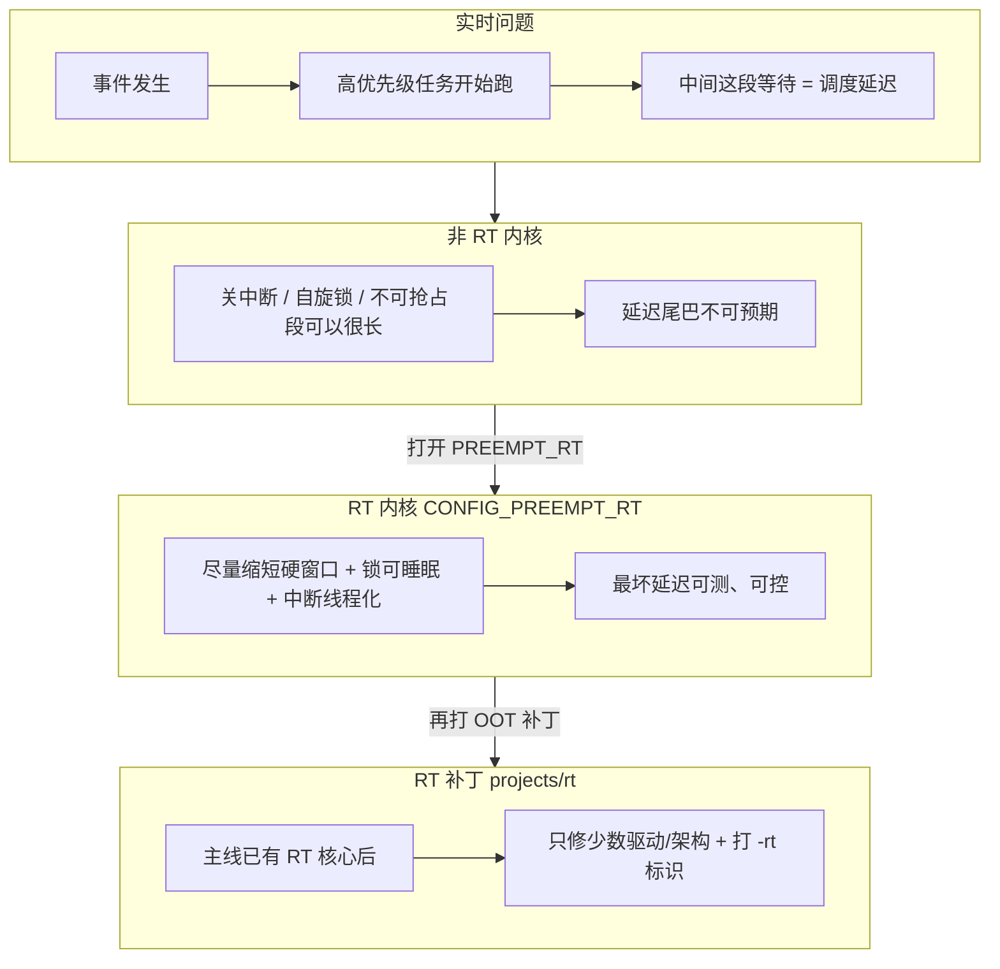

下文按固定顺序：**背景 → 非 RT → RT → 补丁**。

---

## 第 0 章：零基础必会的四个概念

### 0.1 用户态任务 vs 内核

- **用户态**：你的程序（包括周期控制任务）。  
- **内核**：调度、驱动、网络、文件系统。程序一调系统调用、一来中断，就进入内核路径。  
- 实时任务“能不能准时跑”，经常卡在**别人正在内核里干什么**，而不只是用户态谁优先级高。

### 0.2 中断

硬件（网卡、定时器、GPU）有事就打断 CPU → **硬中断**。  
硬中断里通常只做最少工作；剩下的可放到 **softirq / 工作队列 / 中断线程**。  
若硬中断或 softirq 很长，等于临时“霸占”CPU，你的实时任务只能等。

### 0.3 调度与优先级

调度器在可运行任务里选一个跑。实时策略（如 FIFO）下，**更高优先级应尽快抢走 CPU**。  
但若当前 CPU 处于“不可抢占”或“关中断”，调度器也插不进手——这就是延迟的根源之一。

### 0.4 延迟（latency）与抖动（jitter）

| 词 | 含义 |
|----|------|
| 延迟 | 从“该跑了”到“真正跑起来”等了多久 |
| 抖动 | 这次等 50µs、下次等 800µs——尾巴拉得很长 |

**硬实时关心的是最坏情况（worst-case），不是平均值。**  
非 RT 往往平均还行，最坏很差；RT 就是冲着最坏来的。

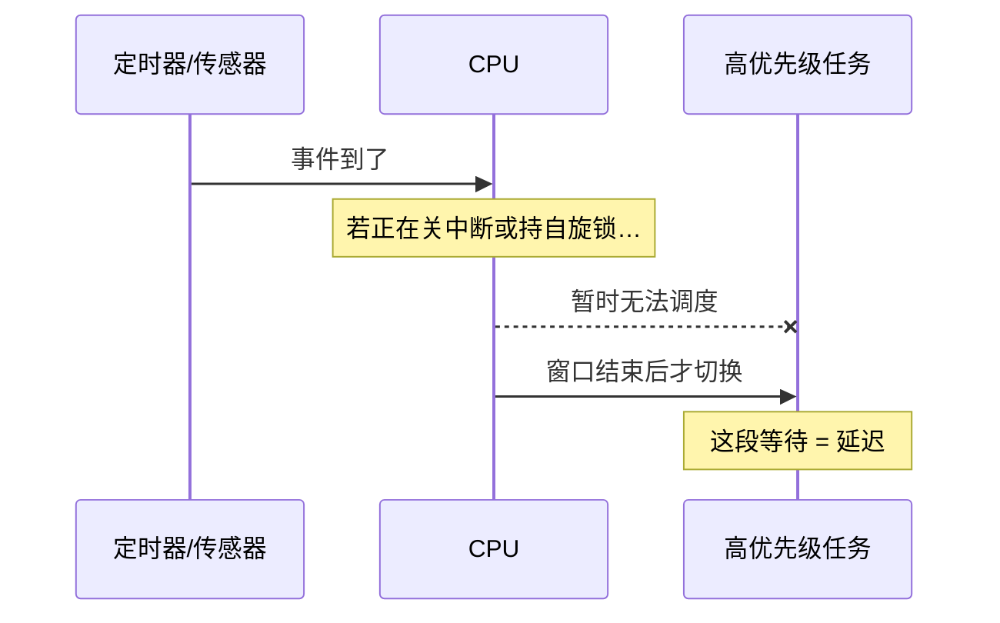

### 0.5 内核里说的「睡眠」是什么

- **睡眠** = 当前执行路径主动让出 CPU（进入等待队列），调度器可以去跑别人。  
- **不能睡眠** = 必须一直占着 CPU 把这段跑完（典型：关中断中、持**自旋**锁时）。  
- 后文「`spinlock_t` 在 RT 上可睡眠」= 拿不到锁时可以让出 CPU，而不是死转；因此**绝不能**在已经“不能睡眠”的上下文里再去拿它。

---

## 第 1 章：非 RT 是怎么样的

### 1.1 设计目标（先记住）

| | 非 RT |
|--|--------|
| 优先 | 吞吐、公平、驱动好写 |
| 不保证 | 最坏调度延迟有工程上界 |
| 典型 | 服务器、桌面、一般嵌入式 |

### 1.2 抢占：内核里不是随时能被抢走

用户态任务通常可被抢占。进了内核，要看配置：

| 配置 | 内核态抢占大致情况 |
|------|-------------------|
| `PREEMPT_NONE` | 多半只在主动调度点才切出 |
| `PREEMPT_VOLUNTARY` | 更多主动抢占点 |
| `PREEMPT`（低延迟桌面） | 多数路径可抢占，但**持自旋锁 / 关中断时仍不能抢** |

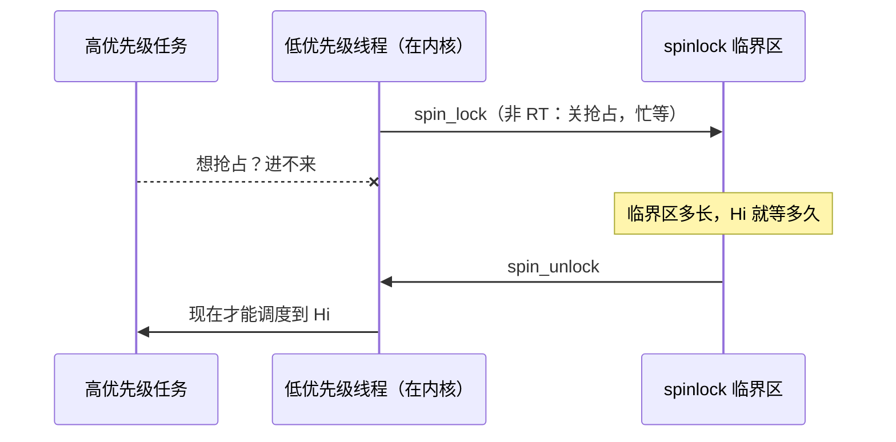

**要点：** 低优先级只要在内核里拿着自旋锁做一件稍长的事，高优先级必须干等。网卡、文件系统、GPU 驱动都可能把这段拉长 → **最坏延迟不可预期**。

### 1.3 锁与关中断：非 RT 的默认写法

```c
local_irq_disable();    /* 本 CPU 暂时不响应中断 */
spin_lock(&lock);       /* 忙等；持锁期间不能睡眠、同 CPU 不能抢占 */
/* 访问共享数据 */
spin_unlock(&lock);
local_irq_enable();
```

| 机制 | 非 RT 下的含义 |
|------|----------------|
| `spinlock_t` | **真正自旋**；持锁 ≈ 原子上下文 |
| `local_irq_disable` | 防中断里再抢同一把锁；副作用是**推迟一切中断唤醒** |
| softirq | 常在中断返回路径跑，可插在实时任务前面 |

驱动作者默认契约：

> “我持着 spinlock / 我关着中断 ⇒ 我不会睡觉，也不会被同 CPU 抢走。”

整棵内核大量代码按这个契约写。

### 1.4 非 RT 延迟从哪里堆出来

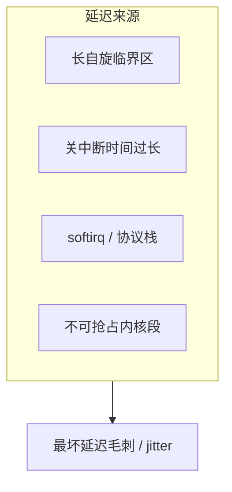

**一次“迟到”的典型故事：**

1. 控制任务本该在时刻 T0 跑。  
2. 同 CPU 上驱动正在 `local_irq_disable` + `spin_lock` 处理 DMA/显示/网络。  
3. 定时器中断进不来，或进来了但 softirq 很长。  
4. 解锁并开中断后，才调度到控制任务 → 周期抖动。

非 RT **不是不能跑实时任务**，而是：**最坏情况没有可靠上界**。

### 1.5 优先级反转（非 RT 里很常见）

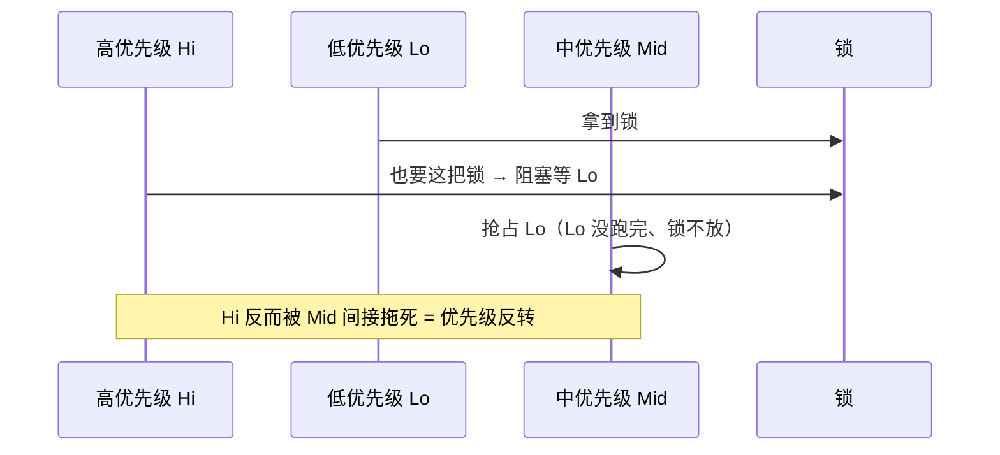

低优先级持锁时，中优先级可以抢走 CPU，高优先级干等锁 → 有效优先级被“拉低”。  
RT 用**优先级继承**等机制缓解：持锁的低优先级会临时“抬”到等待者的优先级，尽快做完并放锁。

---

## 第 2 章：RT 是怎么样的

### 2.1 设计目标

| | RT（`CONFIG_PREEMPT_RT=y`） |
|--|------------------------------|
| 优先 | **最坏调度延迟可控、可测** |
| 手段 | 缩短硬窗口；锁改可睡眠；中断线程化；优先级继承 |
| 代价 | 实现复杂；部分吞吐下降；驱动必须遵守新规则 |

≥ **Linux 6.12** 起，RT 核心已进主线；不必再靠“整包巨型补丁”才能变 RT。

### 2.2 同一场景：非 RT vs RT（并排对照）

假设：高优先级任务要跑，低优先级线程正持有一把普通 `spinlock_t`。

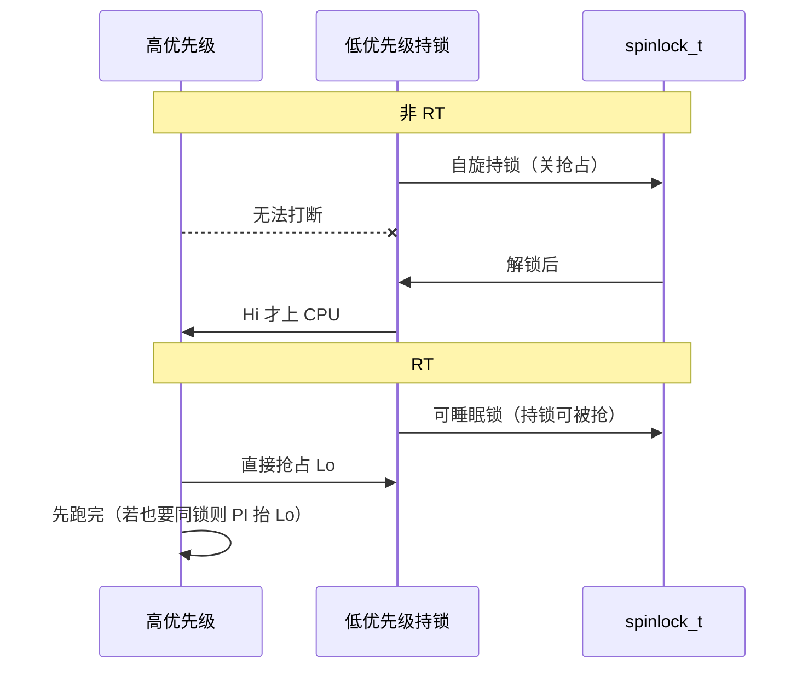

### 2.3 和非 RT 对照：规则翻了哪些


| 维度 | 非 RT | RT |
|------|-------|-----|
| 优化目标 | 吞吐 / 易写 | 最坏延迟 |
| 内核抢占 | 硬窗口多 | 除 raw 区外几乎可抢占 |
| `spinlock_t` | 自旋 | **可睡眠锁**（持锁可被更高优先级抢走） |
| `raw_spinlock_t` | 硬锁 | **仍硬锁**；真正不能睡的短临界区 |
| 多数硬中断 | 中断里直接干重活 | **线程化**（`irq/NNN-name`），可设优先级 |
| softirq | 易拖住实时任务 | 倾向线程化，干扰变可控 |
| 关中断大段 | 驱动常用 | 视为延迟毒药 |

### 2.4 为什么 `spinlock` 一可睡眠，旧驱动就炸

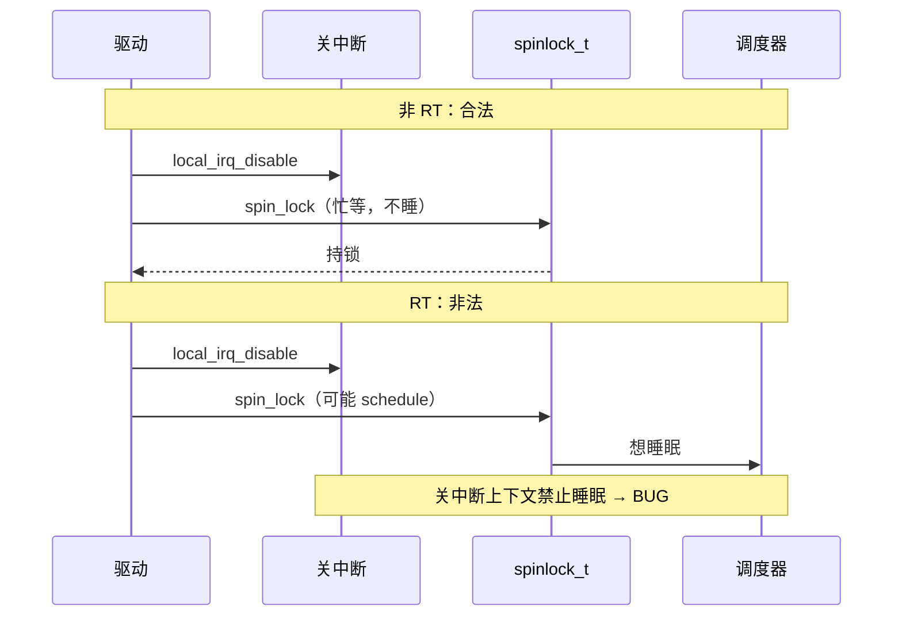

**铁律（读补丁时反复用）：**

> RT 上：`spinlock_t` 可能睡眠。  
> **关中断 / 硬中断 / 关抢占 / RCU read-side 里，禁止再拿 `spinlock_t`。**

### 2.5 合法写法只有几类（补丁全在干这些）

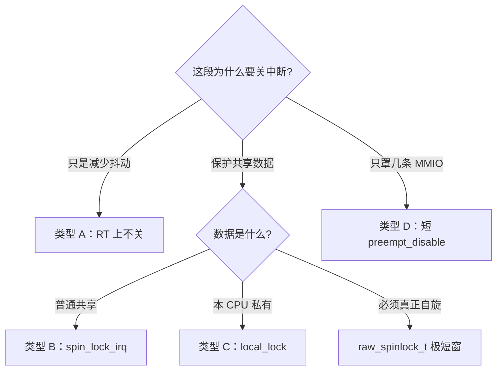

| 类型 | 做法 | 直觉 |
|------|------|------|
| A | `if (!PREEMPT_RT) local_irq_disable()` | 关中断不是锁，RT 上拿掉 |
| B | `spin_lock_irq()` / `_irqsave` | 锁和中断状态绑在同一 API |
| C | `local_lock*` | 专门保护 per-CPU 数据 |
| D | 短 `preempt_disable` | 纯读寄存器/打戳，段内绝不睡 |
| E | 判定加上 `rcu_preempt_depth()` | RT 持睡眠锁会进 RCU，不能再睡 |
| F | 禁用功能或关掉 trace | 改不安全就关掉 |
| （硬锁） | `raw_spinlock_t` | 唯一允许的真自旋；必须极短 |

### 2.6 RT 如何把延迟“框住”


对比非 RT：从“被偶然的长临界区拖死”变成“主要由 **raw 窗口 + 调度延迟** 决定”，才能用 cyclictest 谈上界。

### 2.7 一张总表背下来

| 问题 | 非 RT | RT |
|------|-------|-----|
| 高优先级能否打断持锁的内核路径？ | 持 spinlock 时通常不能 | 持可睡眠 spinlock 时可以 |
| 中断能不能压过实时任务？ | softirq/重 handler 经常可以 | 线程化后可用优先级压住 |
| 最坏延迟？ | 难谈上界 | 可测、可优化 |
| 驱动作者假设？ | 持锁=原子 | 必须按铁律改写 |

---

## 第 3 章：RT 补丁修改了什么

### 3.1 先分两层——这是最容易混的一点

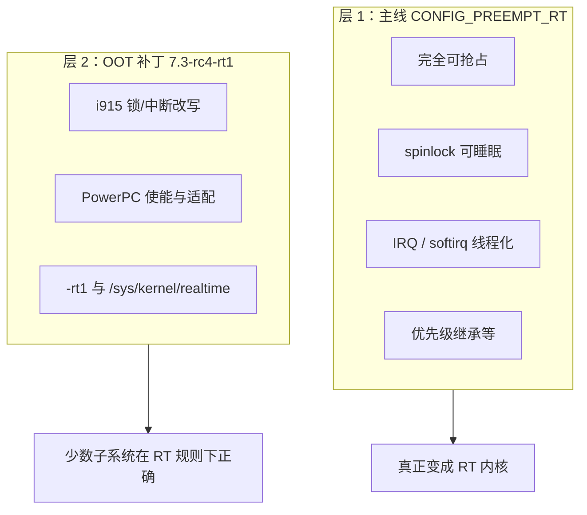

| 层 | 谁提供 | 作用 |
|----|--------|------|
| **主线 RT** | 内核选项 `PREEMPT_RT` | 完成第 2 章的规则切换 |
| **本版补丁** | `projects/rt/7.3/patch-…rt1` | 收尾：驱动/架构仍按非 RT 习惯写的路径 + 版本标识 |

**本版合并补丁只有约 500 行。**  
实时能力的主体在层 1；补丁是层 2。只读这 500 行，**看不到**完整 RT，只能看到“还在修的边角”。

对常见 **x86_64** 读者：层 1 在主线里打开即可；本版 OOT 里和你最相关的通常是 **i915** 一组，PowerPC 段说明“架构适配长什么样”，不必本机是 PowerPC 才需要读懂思路。

### 3.2 历史一句话

早期 RT 整包都是巨大 out-of-tree 补丁。多年合入主线后，到 6.12+ 核心已在树内；`cdn.kernel.org/.../projects/rt/` 上现在主要是**残留适配**。

### 3.3 本版补丁在改什么（按问题归类）

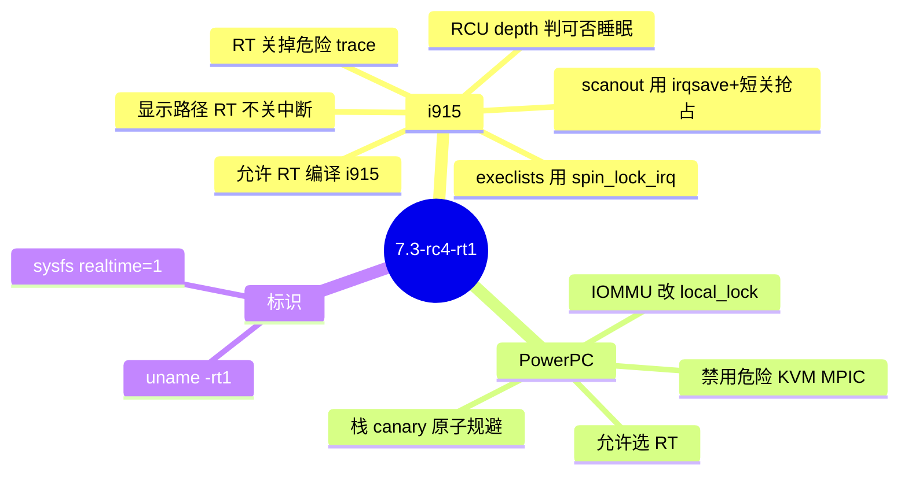

| 旧习惯（非 RT 契约） | 补丁做法 | 类型 |
|----------------------|----------|------|
| i915 原子更新整段关中断，段内再拿锁 | RT 上不关中断 | A |
| 读 scanout：关中断 + uncore 锁 | `spin_lock_irqsave` + RT 下短 `preempt_disable` | B+D |
| execlists：`local_irq_disable`+`spin_lock` | 改为 `spin_lock_irq` | B |
| `GEM_BUG_ON(!irqs_disabled())` | 删除，靠 lockdep | — |
| 只靠 `in_atomic/irqs_disabled` 判断可否睡 | 加上 `rcu_preempt_depth()` | E |
| i915 trace 求参时拿锁 | RT 上 NOTRACE | F |
| Kconfig 禁止 RT 选 i915 | 修完后撤销禁止 | — |
| PPC IOMMU 关中断保护 per-CPU 页 | `local_lock` | C |
| 从核原子上下文调随机 canary | 用栈地址派生 | — |
| KVM MPIC raw 锁长循环 | RT 禁用该选项 | F |
| PPC 不能选 RT | `ARCH_SUPPORTS_RT` | — |
| 难识别是否 RT | `-rt1`、`/sys/kernel/realtime` | 标识 |

### 3.4 用时序看清补丁的价值

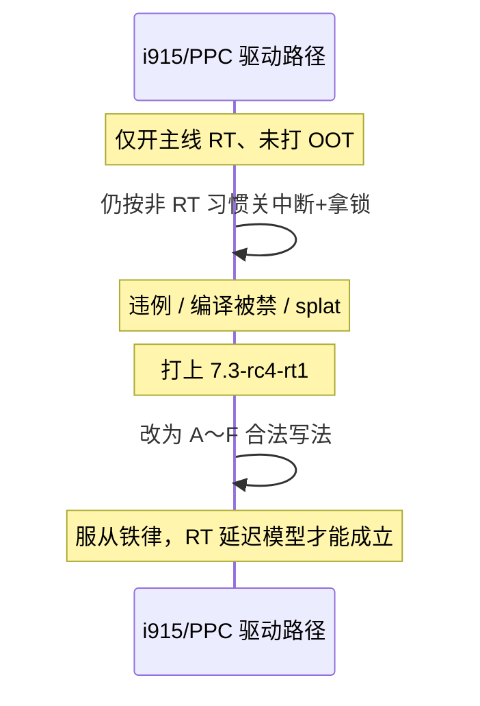

### 3.5 补丁没有做什么（避免误解）

- 没有重新实现调度器  
- 不能替代 `CONFIG_PREEMPT_RT=y`  
- 不会自动让所有驱动都实时安全  
- 不自带 cyclictest；延迟要另测  

---

## 第 4 章：你怎么确认自己在跑 RT

```bash
uname -r                    # 应含 -rt（如 …-rt1）
cat /sys/kernel/realtime    # 应为 1
# 配置中应有 CONFIG_PREEMPT_RT=y
```

打补丁：主线树必须是 **v7.3-rc4**，再应用 `patches/patch-7.3-rc4-rt1.patch.xz`。

---

## 第 5 章：读完自检（过不了就回看对应节）

| # | 你应能口头答出 | 对应 |
|---|----------------|------|
| 1 | 延迟和抖动各指什么？硬实时看平均还是最坏？ | §0.4 |
| 2 | 非 RT 下高优先级为何插不进持 spinlock 的内核路径？ | §1.2 |
| 3 | 什么是优先级反转？RT 靠什么缓解？ | §1.5 |
| 4 | RT 上 `spinlock_t` 和 `raw_spinlock_t` 差别？ | §2.3 |
| 5 | 铁律是哪一句？为何旧驱动的关中断+spinlock 会炸？ | §2.4 |
| 6 | 改写类型 A/B/C/D/E/F 各解决哪类问题？ | §2.5 |
| 7 | 主线 `PREEMPT_RT` 和本版 OOT 补丁谁负责“变 RT”、谁负责“收尾”？ | §3.1 |
| 8 | 本版补丁大概改了 i915 / PPC / 标识里的哪些事？ | §3.3 |

## 第 6 章：三句话 + 下一篇

1. **非 RT**：自旋锁 + 关中断 → 硬窗口长 → 最坏延迟抖。  
2. **RT**：可睡眠锁 + 中断线程化 + 短 raw 窗 → 最坏延迟可测。  
3. **本版补丁**：在主线已是 RT 的前提下，把 i915/PPC 旧契约改合规，并打上 `-rt1`。

**下一篇** [RT详解.md](RT详解.md)：目录怎么读；`patches/series/` 每个文件的旧码/新码/类型字母。
