# Linux RT 详解：目录、原理与源码

> 请先读完 [RT简明.md](RT简明.md)。本文把同一套模型钉到**目录结构**和 **`patches/series/` 每一份源码**上。  
> 版本：**7.3-rc4-rt1**。合并包：`patches/patch-7.3-rc4-rt1.patch.xz`；拆分：`patches/series/`。

---

## 阅读地图

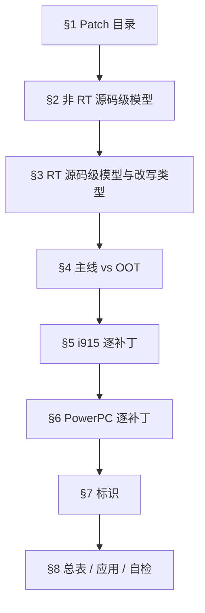

每节补丁固定三问：**改哪个文件 → 旧码为何在 RT 下错 → 新码落到简明里的哪种改写类型**。

---

## 1. Patch 目录（先摸清材料）

### 1.1 官方发布树

```
https://cdn.kernel.org/pub/linux/kernel/projects/rt/
└── 7.3/
    ├── patch-7.3-rc4-rt1.patch.xz      ← 一次打进主线树
    ├── patch-7.3-rc4-rt1.patch.sign
    ├── patches-7.3-rc4-rt1.tar.xz      ← 拆成 series（给人读）
    ├── sha256sums.asc
    ├── incr/                           ← 增量
    └── older/                          ← 历史 rt 号
```


| 产物 | 你拿它干什么 |
|------|----------------|
| `patch-VERSION-rtN.patch.xz` | 编内核时打补丁 |
| `patches-*.tar.xz` | 看 Subject、动机、单点 diff |
| 签名 / sha256 | 校验下载完整性 |

**版本对齐：** 本补丁必须打在 **`v7.3-rc4`** 上，不是随意一个 7.3。

### 1.2 本仓库布局

```
rt-patch/
├── RT_PATCH_URL.md          # 下载地址
├── docs/RT简明.md           # 原理入门
├── docs/RT详解.md           # 本文
└── patches/
    ├── patch-7.3-rc4-rt1.patch.xz
    ├── patches-7.3-rc4-rt1.tar.xz
    ├── sha256sums.asc
    └── series/              # 已展开，建议对着读
        ├── series           # 清单与分组
        ├── 0001-…0008-…     # DRM/i915
        ├── drm-i915-Consider-RCU-…
        ├── powerpc_* / POWERPC_*
        ├── sysfs__…
        └── Add_localversion_…
```

### 1.3 `series` 文件：分组与顺序

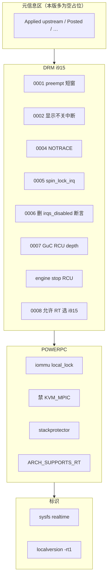

生效共 **14** 个补丁。缺 `0003` 是历史编号习惯，不是漏文件。  
上游讨论入口（i915 一组）：`https://lore.kernel.org/all/20240613102818.4056866-1-bigeasy@linutronix.de/`

| 顺序 | 文件（`patches/series/`） | 类型 |
|------|---------------------------|------|
| 1 | `0001-drm-i915-Use-preempt_disable-enable_rt-where-recomme.patch` | B+D |
| 2 | `0002-drm-i915-Don-t-disable-interrupts-on-PREEMPT_RT-duri.patch` | A |
| 3 | `0004-drm-i915-Disable-tracing-points-on-PREEMPT_RT.patch` | F |
| 4 | `0005-drm-i915-gt-Use-spin_lock_irq-instead-of-local_irq_d.patch` | B |
| 5 | `0006-drm-i915-Drop-the-irqs_disabled-check.patch` | 断言 |
| 6 | `0007-drm-i915-guc-Consider-also-RCU-depth-in-busy-loop.patch` | E |
| 7 | `drm-i915-Consider-RCU-read-section-as-atomic.patch` | E |
| 8 | `0008-Revert-drm-i915-Depend-on-PREEMPT_RT.patch` | 开门 |
| 9 | `powerpc_pseries_iommu__Use_a_locallock_instead_local_irq_save.patch` | C |
| 10 | `powerpc_kvm__Disable_in-kernel_MPIC_emulation_for_PREEMPT_RT.patch` | F |
| 11 | `powerpc_stackprotector__work_around_stack-guard_init_from_atomic.patch` | 原子规避 |
| 12 | `POWERPC__Allow_to_enable_RT.patch` | 使能 |
| 13 | `sysfs__Add__sys_kernel_realtime_entry.patch` | 标识 |
| 14 | `Add_localversion_for_-RT_release.patch` | 标识 |

---

## 2. 非 RT：落到代码上的模型

### 2.1 `spin_lock` 在非 RT 里实际做了什么

简化理解（抓住效果即可）：

1. 关闭（或升高）本 CPU 抢占计数 → **同 CPU 高优先级插不进来**  
2. 忙等直到拿到锁  
3. 持锁期间 **禁止睡眠**（不能 `schedule`、不能拿互斥量去睡）

所以：临界区有多长，同 CPU 上所有更高优先级任务就至少要等多久。

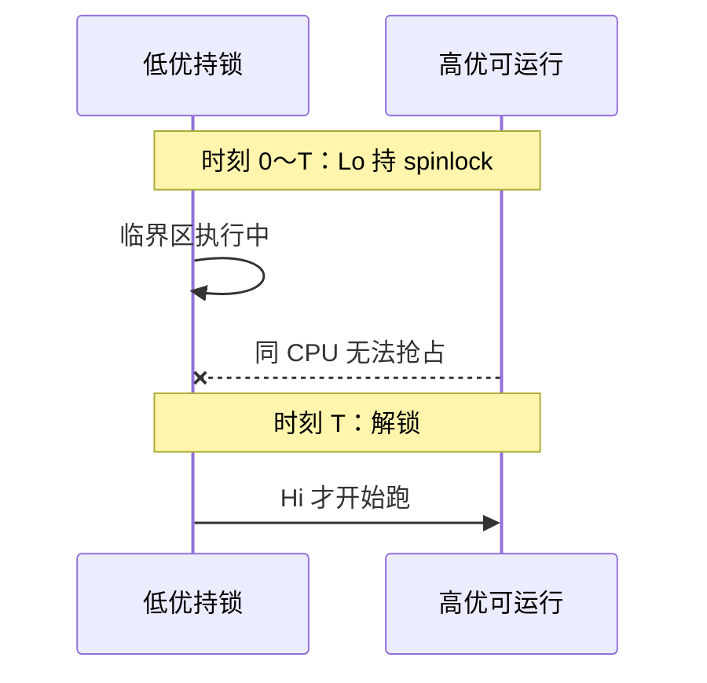

### 2.2 为什么总爱写 `local_irq_disable` + `spin_lock`

```c
spin_lock_irq(&lock);  /* 等价于：关中断 + spin_lock */
```

两个目的：

1. **正确性：** 防止本 CPU 中断处理函数再抢同一把锁 → 死锁  
2. **顺带减抖：** 有人用关中断包住一大段“尽量别被打断”的更新（显示管线常见）

第 2 点在非 RT 能跑；在 RT 上会和第 3 章铁律冲突——因为锁本身可能睡眠。

### 2.3 softirq：实时任务前面的隐形队伍

硬中断返回前可跑 softirq（网络收包等）。它不是普通进程，优先级模型不同，可能让“FIFO 很高”的任务仍然迟到。这是非 RT 最坏延迟难谈的原因之一。

### 2.4 非 RT 驱动的隐含契约（补丁就是来打破它的）

> 持有 `spinlock_t` 或关着中断 ⇒ 我处于原子上下文，不会睡眠，也不期望被同 CPU 抢占。

`local_irq_disable()` 包大段、`trace` 里顺带读 MMIO 拿锁、用 `irqs_disabled()` 当断言，都建立在这契约上。

---

## 3. RT：源码级模型与改写类型表

### 3.1 `spinlock_t` 语义翻转

`CONFIG_PREEMPT_RT=y` 时，普通 `spinlock_t` 变为 **可睡眠锁**（rtmutex 一类）：

- 竞争时可以睡眠，让出 CPU  
- 持锁者可被更高优先级抢占  
- 优先级继承减轻优先级反转  

**旧契约整条作废。**

### 3.2 硬锁只剩 `raw_spinlock_t`

调度器、部分中断控制器底层等仍用 `raw_spinlock_t`：真正自旋、临界区必须极短。  
驱动若把大段逻辑塞进 raw 锁，等于亲手毁掉实时性。

### 3.3 中断线程化

多数 IRQ 耗时工作放到 `irq/NNN-*` 线程 → 可设实时优先级 → 高优先级任务可以压过低优先级中断线程。硬中断入口只做最少事。

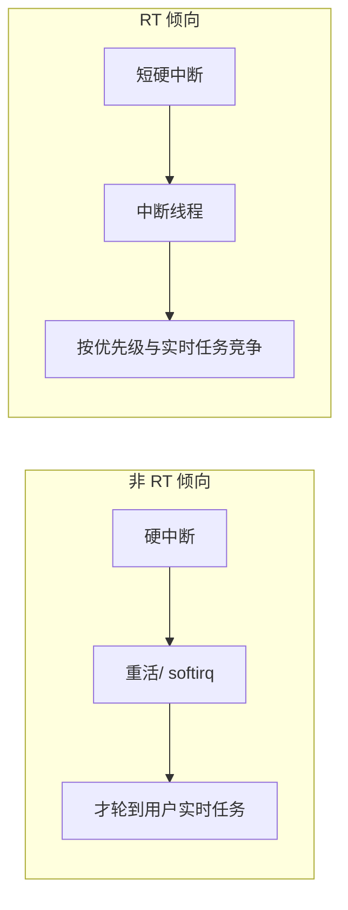

### 3.4 铁律

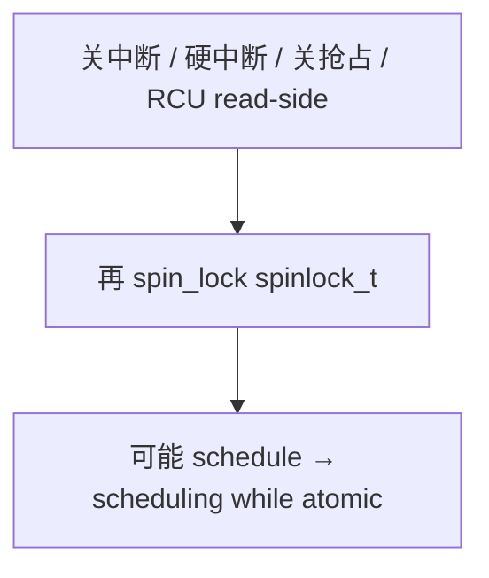

### 3.5 改写类型（后文用字母引用）

| 类型 | 做法 | 一句话 |
|------|------|--------|
| **A** | RT 上取消大段 `local_irq_disable` | 关中断只是减抖时拿掉 |
| **B** | `spin_lock` → `spin_lock_irq(save)` | 锁与中断状态绑定 |
| **C** | 关中断保护 per-CPU → `local_lock*` | 用对原语 |
| **D** | 短 `preempt_disable` 罩 MMIO | 锁不再关抢占时补上 |
| **E** | 原子判定加 `rcu_preempt_depth()` | RT 持睡眠锁 ≈ 在 RCU read |
| **F** | 禁用功能 / 关 trace | 改不安全就关掉 |

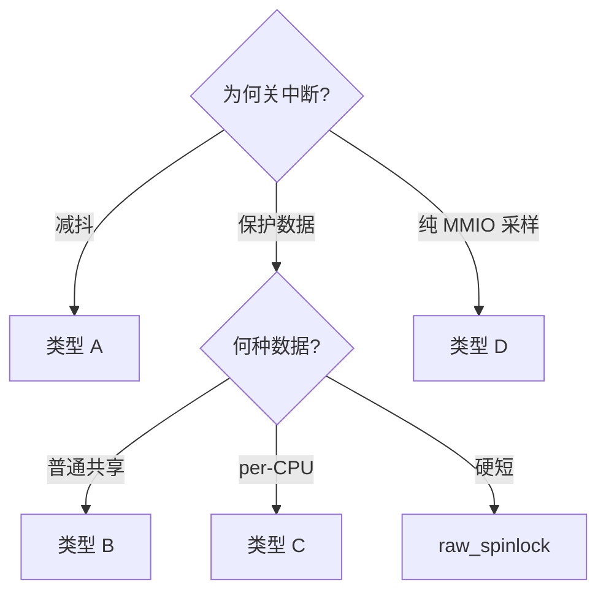

### 3.6 为什么必须看 RCU depth（类型 E 的根）

RT 上拿到可睡眠 `spinlock_t` 会进入 **RCU read-side**。此时：

- `in_atomic()` 可能仍是假  
- `irqs_disabled()` 可能仍是假  
- 但 **不能再 `schedule`**

只检查前两个就会在 RCU 里睡觉 → splat。故补上 `rcu_preempt_depth()`。

---

## 4. 主线 RT vs 本版 OOT

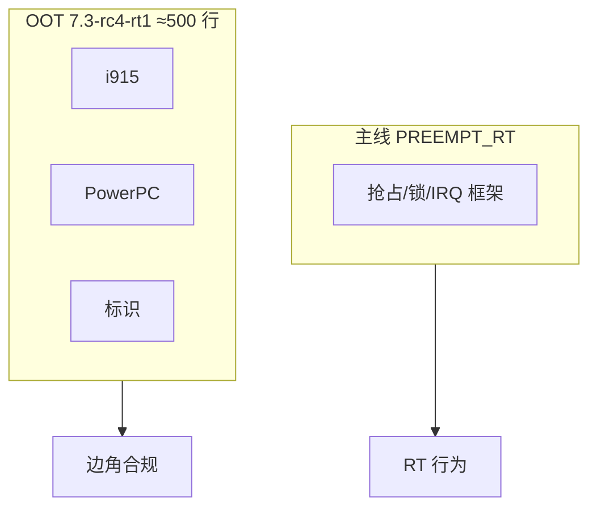

| | 主线 | 本版 OOT |
|--|------|----------|
| 体量 | 大（已合入） | 小 |
| 不打会怎样 | 仍可选 RT | 部分驱动禁编或运行违例 |

---

## 5. i915 系列：对照源码

路径均相对 **打补丁后的 Linux 树**；本地 diff 在 `patches/series/<文件名>`。

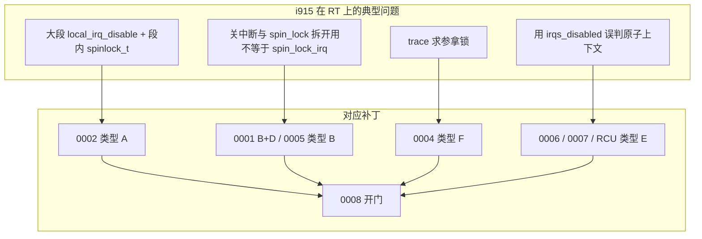

建议阅读顺序：先 0002（最好懂的类型 A）→ 0005（类型 B）→ 0001（B+D）→ 0004/0006/0007/RCU → 0008。

---

### 5.1 `0001` — scanout：类型 B + D

**文件：** `drivers/gpu/drm/i915/display/intel_vblank.c`  
**补丁：** `0001-drm-i915-Use-preempt_disable-enable_rt-where-recomme.patch`

**旧逻辑（概念）：**

```c
local_irq_save(flags);
intel_vblank_section_enter(display); /* 内含 spin_lock(uncore->lock) */
/* 读扫描线、打时间戳 */
intel_vblank_section_exit(display);
local_irq_restore(flags);
```

**RT 下错在哪：**

1. `spinlock_t` 不再隐含关抢占 → 采样窗被打断，时间戳抖。  
2. “先 irqsave 再单独拿锁” 与 RT 锁模型不匹配，易踩可睡眠锁。

**新逻辑：**

```c
/* enter_irqf 内部：spin_lock_irqsave(&uncore->lock, *flags)  → 类型 B */
intel_vblank_section_enter_irqf(display, &irqflags);

if (IS_ENABLED(CONFIG_PREEMPT_RT))
	preempt_disable();     /* 类型 D：只罩寄存器读写 */

/* stime / MMIO / etime —— 注释：must not block */

if (IS_ENABLED(CONFIG_PREEMPT_RT))
	preempt_enable();

intel_vblank_section_exit_irqf(display, irqflags);
```

`intel_get_crtc_scanline()` 同样改为 `_irqf`。

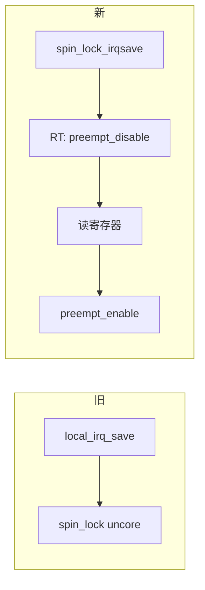

**注意：** `__intel_get_crtc_scanline` 最坏可约 100µs（补丁原说明），属已知折中。

---

### 5.2 `0002` — 原子更新：类型 A

**文件：** `intel_crtc.c`、`intel_cursor.c`、`intel_vblank.c`  
**补丁：** `0002-drm-i915-Don-t-disable-interrupts-on-PREEMPT_RT-duri.patch`

**旧：** `intel_pipe_update_start/end`、cursor、vblank evade 循环：

```c
local_irq_disable();
/* wait / vblank_put / plane 更新 / arm event
   → 拿 vbl_lock、uncore.lock、event_lock 等 spinlock_t */
local_irq_enable();
```

**错：** 关中断后拿可睡眠锁。补丁写明：关中断是为减抖，**不是同步必需**。

**新：**

```c
if (!IS_ENABLED(CONFIG_PREEMPT_RT))
	local_irq_disable();
/* … */
if (!IS_ENABLED(CONFIG_PREEMPT_RT))
	local_irq_enable();
```

`intel_vblank_evade` 里 `schedule_timeout` 前后同样处理——关中断时本就不能睡。


---

### 5.3 `0004` — trace：类型 F

**文件：** `i915_trace.h`、`intel_display_trace.h`、`intel_uncore_trace.h`

```c
#if defined(CONFIG_PREEMPT_RT) && !defined(NOTRACE)
#define NOTRACE
#endif
```

**真实 splat 链：**  
`trace_…pipe_update_start` 求参 → `get_vblank_counter` → `gen6_read32` → `rt_spin_lock`，而 trace 处在关抢占上下文。

**结论：** RT 构建关掉这些 i915 ftrace 事件，换正确性。

---

### 5.4 `0005` — execlists：类型 B

**文件：** `drivers/gpu/drm/i915/gt/intel_execlists_submission.c`

**旧：**

```c
static void execlists_dequeue_irq(...)
{
	local_irq_disable();
	execlists_dequeue(engine); /* 内含 spin_lock(&sched_engine->lock) */
	local_irq_enable();
}
```

非 RT 下“外层关中断 + 内层 spin_lock”≈ `spin_lock_irq`。  
RT 下二者**不等价**，且外层关中断后内层可睡眠锁非法。

**新：**

```c
spin_lock_irq(&sched_engine->lock);
/* dequeue */
spin_unlock_irq(&sched_engine->lock);
```

删除 wrapper；tasklet 直接调 `execlists_dequeue`。解锁后的尾巴在开中断下跑（作者确认不再二次抢锁）。

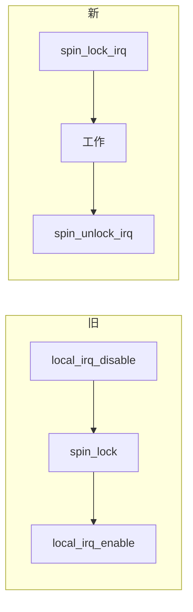

---

### 5.5 `0006` — 删错误断言

**文件：** `i915_request.c`（`__i915_request_submit` / `unsubmit`）

```c
/* 删除这两行思路 */
GEM_BUG_ON(!irqs_disabled());
/* 保留 */
lockdep_assert_held(&engine->sched_engine->lock);
```

**错：** RT 持可睡眠锁时中断可以仍开着；用“中断关着”代理“持锁正确”会误杀。  
**对：** 用 lockdep 查是否持锁。

---

### 5.6 `0007` — GuC busy loop：类型 E

**文件：** `drivers/gpu/drm/i915/gt/uc/intel_guc.h`

```c
bool not_atomic = !in_atomic() && !irqs_disabled() && !rcu_preempt_depth();
```

`not_atomic == false` → 只能忙等，不能睡。见 §3.6。

---

### 5.7 RCU atomic — `stop_timeout`：类型 E

**文件：** `intel_engine_cs.c`  
**补丁：** `drm-i915-Consider-RCU-read-section-as-atomic.patch`

```c
if (in_atomic() || irqs_disabled() || rcu_preempt_depth())
	return 0;   /* 不要 schedule_timeout */
```

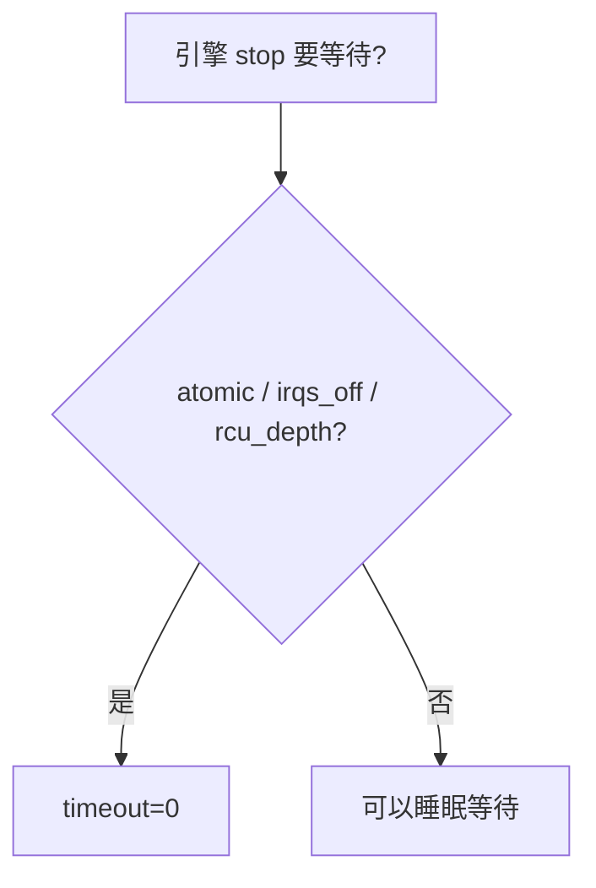

---

### 5.8 `0008` — 开门：允许 RT 选 i915

**文件：** `drivers/gpu/drm/i915/Kconfig`

```diff
-	depends on !PREEMPT_RT
```

前面违例清完才能撤销。系列中应放在 i915 最后。

---

## 6. PowerPC 系列：对照源码

### 6.1 IOMMU — 类型 C

**文件：** `arch/powerpc/platforms/pseries/iommu.c`  
**补丁：** `powerpc_pseries_iommu__Use_a_locallock_instead_local_irq_save.patch`

**旧：**

```c
static DEFINE_PER_CPU(__be64 *, tce_page);
local_irq_save(flags);
tcep = __this_cpu_read(tce_page);
/* 可能 GFP_ATOMIC 分配 */
local_irq_restore(flags);
```

保护的是 **本 CPU 临时页指针**，手段却是整 CPU 关中断。

**新：**

```c
struct tce_page {
	__be64 *page;
	local_lock_t lock;
};
static DEFINE_PER_CPU(struct tce_page, tce_page) = {
	.lock = INIT_LOCAL_LOCK(lock),
};

local_lock_irqsave(&tce_page.lock, flags);
tcep = __this_cpu_read(tce_page.page);
...
local_unlock_irqrestore(&tce_page.lock, flags);
```

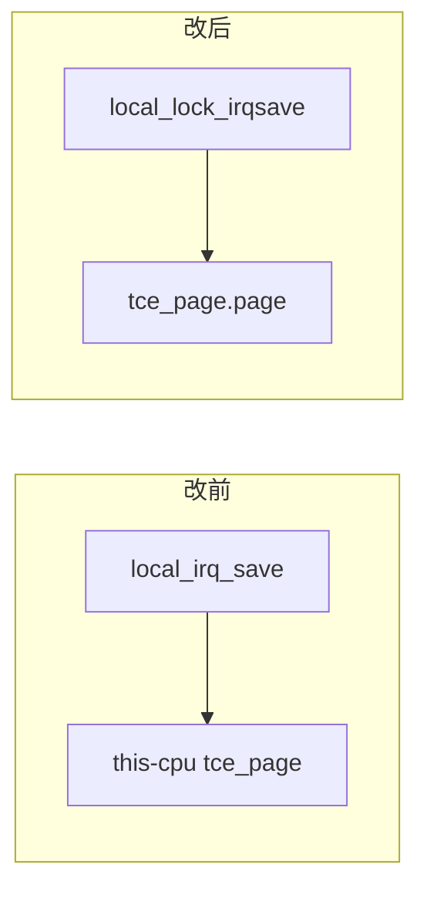

---

### 6.2 KVM MPIC — 类型 F（策略禁用）

**文件：** `arch/powerpc/kvm/Kconfig`

```kconfig
config KVM_MPIC
	depends on !PREEMPT_RT
```

directed delivery + 多 CPU mask 时，仿真持 **raw 锁** 双重循环扫 VCPU/pending IRQ → 主机长时间不可抢占，可被恶意 guest 拉成延迟 DoS。  
不是“编译不过”，是**实时安全策略**。

---

### 6.3 stackprotector — 原子路径规避

**文件：** `arch/powerpc/include/asm/stackprotector.h`

```c
#ifndef CONFIG_PREEMPT_RT
	canary = get_random_canary();
#else
	canary = ((unsigned long)&canary) & CANARY_MASK;
#endif
```

从核启动在原子上下文调 `boot_init_stack_canary()`；RT 上随机数路径可能不适配。用栈地址做初始值（类比 x86 用 TSC 一类思路）。

---

### 6.4 允许架构选 RT

**文件：** `arch/powerpc/Kconfig`

```kconfig
select ARCH_SUPPORTS_RT if HAVE_POSIX_CPU_TIMERS_TASK_WORK
```

无 `ARCH_SUPPORTS_RT` 后 menuconfig 才能勾 `PREEMPT_RT`。条件：架构具备 RT 所需的 posix cpu timer task_work 能力。

---

## 7. 标识类补丁

### 7.1 `/sys/kernel/realtime`

**文件：** `kernel/ksysfs.c`  
**补丁：** `sysfs__Add__sys_kernel_realtime_entry.patch`

```c
#if defined(CONFIG_PREEMPT_RT)
static ssize_t realtime_show(...)
{
	return sprintf(buf, "%d\n", 1);
}
KERNEL_ATTR_RO(realtime);
#endif
```

仅 RT 构建存在，恒为 `1`。方便 udev/脚本，不必反复解析 `uname`。

### 7.2 `localversion-rt`

**新文件内容：** `-rt1`  

构建拼进 `UTS_RELEASE` → `uname -r` 形如 `…-rt1`，与官方发布号对齐。

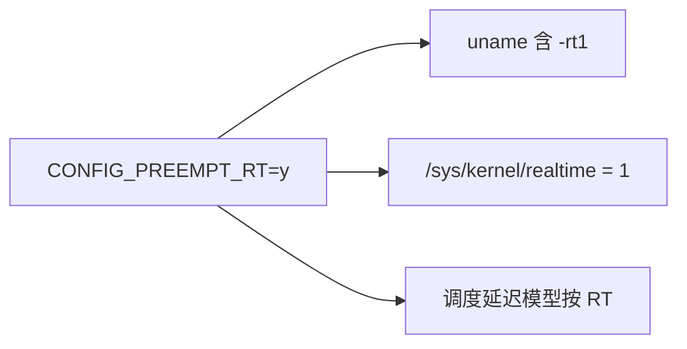

---

## 8. 触及文件总表

| 内核路径 | series 来源 | 类型 |
|----------|-------------|------|
| `localversion-rt` | Add_localversion | 标识 |
| `kernel/ksysfs.c` | sysfs | 标识 |
| `arch/powerpc/Kconfig` | Allow_to_enable_RT | 使能 |
| `arch/powerpc/include/asm/stackprotector.h` | stackprotector | 原子规避 |
| `arch/powerpc/kvm/Kconfig` | kvm MPIC | F |
| `arch/powerpc/platforms/pseries/iommu.c` | iommu | C |
| `drivers/gpu/drm/i915/Kconfig` | 0008 | 开门 |
| `.../display/intel_crtc.c` | 0002 | A |
| `.../display/intel_cursor.c` | 0002 | A |
| `.../display/intel_vblank.c` | 0001, 0002 | B+D, A |
| `.../*trace*.h`（三处） | 0004 | F |
| `.../gt/intel_execlists_submission.c` | 0005 | B |
| `.../i915_request.c` | 0006 | 断言 |
| `.../gt/uc/intel_guc.h` | 0007 | E |
| `.../gt/intel_engine_cs.c` | RCU atomic | E |

---

## 9. 应用与自检

```bash
# 1. 主线树切换到 v7.3-rc4
# 2. 打补丁
xzcat /path/to/patch-7.3-rc4-rt1.patch.xz | patch -p1

# 3. 配置
# CONFIG_PREEMPT_RT=y

# 4. 启动后
uname -r                 # 含 -rt1
cat /sys/kernel/realtime # 1
```

延迟测量用 cyclictest 等（补丁不含测试套件）。若团队有统一脚本规范，走脚本，勿手搓参数。


---

## 10. 收束：两篇文章如何配合

| 问题 | 去哪找答案 |
|------|------------|
| 实时、延迟、非 RT/RT 规则、补丁两层分别干什么 | [RT简明.md](RT简明.md) |
| 目录怎么读、每个 series 文件改哪、对应类型 A～F | 本文 |
| 下载地址 | `RT_PATCH_URL.md` |

**最终一句：**  
主线 `PREEMPT_RT` 负责把内核规则从非 RT 换成 RT；`7.3-rc4-rt1` 负责让 i915/PowerPC 等还在用旧契约的代码服从铁律，并打上 `-rt1` 标识。对着 `patches/series/*.patch` 读时，先标类型字母，再看 diff，零基础也能把“为什么改”钉死。
