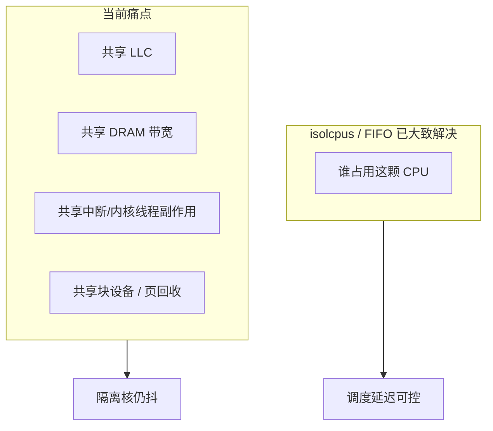
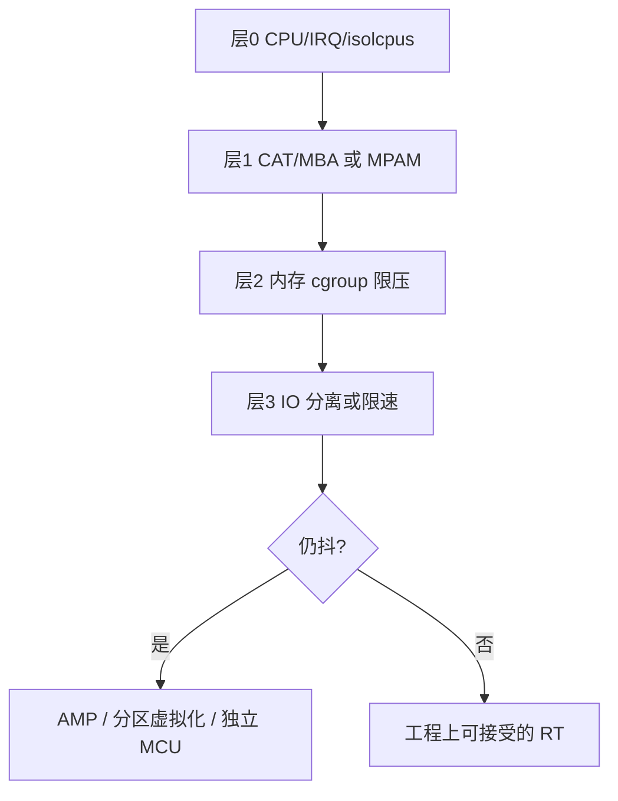

# 隔离核仍受干扰：为何不能只靠调度器，以及如何尽量绝对实时

> 问题背景：已做 CPU 隔离（isolcpus 等）后，其他核在内存/缓存/IO 满载时，实时核仍抖动。  
> 诉求：尽量不受影响，可牺牲其他核性能。  
> 配合阅读：[RT简明.md](RT简明.md) · [RT详解.md](RT详解.md)  
> **软件快切算法研究：** [RT护航算法-快速切断非隔离核资源.md](RT护航算法-快速切断非隔离核资源.md)

---

## 1. 结论

**单靠“重写调度算法 / 再加一层 isolcpu”解决不了该现象。**

调度器只决定**谁在哪颗核上跑**；你被打的是 **LLC、内存带宽、总线、存储队列** 等**核间共享资源**。  
要尽量逼近绝对实时，必须做**分层隔离**，并愿意让其他核变慢甚至饿死。

---

## 2. 为什么“隔离核”仍会被拖累

| 共享物 | 其他核加压时对 RT 核的影响 |
|--------|---------------------------|
| **LLC（末级缓存）** | 脏数据把 RT 工作集挤出 → 命中率掉、抖动升 |
| **内存控制器带宽** | 带宽打满 → RT 核访存变慢（即使不换页） |
| **内核内存管理** | 全局 reclaim / compaction / 直接回收，可能波及或抢锁 |
| **磁盘 / 文件系统** | 队列、中断、写回、journal，拖垮整体延迟 |
| **同 die 互联** | 跨核通信、同 NUMA 节点争用 |

调度器改得再“实时”，也管不了 LLC 和内存控制器。

---

## 3. 正确目标：不是新调度器，而是“护航栈”

在已有 **PREEMPT_RT + SCHED_FIFO/DEADLINE + 隔离核** 之上，按层叠加：

### 层 0：CPU / 中断 / 内核线程

- `isolcpus=domain,managed_irq,<rt_cpus>`
- `nohz_full=<rt_cpus>`、`rcu_nocbs=<rt_cpus>`
- `irqaffinity=` 指到 housekeeping；RT 核尽量 **0 IRQ**
- 工作负载：`taskset` / cpuset 钉死；`mlockall`；避免在 RT 核跑无关内核线程
- 内核：`CONFIG_PREEMPT_RT=y`

这只保证“这颗核上少被抢”；**挡不住缓存和内存带宽**。

### 层 1：缓存与内存带宽（最关键）

**有硬件 QoS 时优先用：**

| 平台 | 手段 | 作用 |
|------|------|------|
| Intel | **CAT**（缓存分区）+ **MBA**（内存带宽限制） | 给 RT 核独占 LLC 路；给非 RT 核限带宽 |
| ARM | **MPAM**（若 SoC 支持） | 类似：缓存/带宽分区 |
| 无 CAT/MPAM | 只能软隔离 + 减负载 | 效果有上限 |

典型策略（牺牲其他核）：

- RT clos：多占 LLC ways
- 非 RT clos：少 ways + **强限 MBA**（把非 RT 带宽上限压低）
- RT 任务：大页 + 绑 NUMA + `mlockall`，工作集放进属于自己的那份 cache

没有 CAT/MPAM 的芯片上，**无法从硬件上真正切开 LLC**，只能减小非 RT 的访存强度（见层 2）。

### 层 2：内存压力隔离

- 非 RT：`memory.high` / `memory.max`（cgroup v2）压住，避免打进全局 reclaim
- 全局：尽量避免 swap；RT 侧永不依赖会被换出的页
- 非 RT 加压进程：限制并发与 mem/cache 强度
- 若可接受：非 RT **降频 / 限 CPU 配额**，减少对 LLC/带宽的吞吐

本质：用**配额和限速**把脏活关进笼子，而不是靠调度器奇迹。

### 层 3：I/O 隔离

- **物理分离最好**：RT 数据走另一块盘或另一 NVMe namespace；系统盘给非 RT
- 做不到则：非 RT 用 `io.max` / `ionice` 限速；RT 路径避免同步大写、同盘随机写
- 块层/NVMe IRQ 绑到 housekeeping，不要落到 RT 核

“共享一块盘还要绝对实时”在工程上几乎必然失败——队列和中断是公共的。

### 层 4：仍不够 → 架构级隔离

| 方案 | 含义 |
|------|------|
| **AMP** | 一核跑裸机/Zephyr/RTOS，其余跑 Linux；核间邮箱通信 |
| **Jailhouse / Xen RT** | 分区 hypervisor，RT 分区独占核+中断 |
| **独立 MCU/SoC** | 硬实时任务挪出 Linux |

Linux + 共享 LLC/DRAM 的 COTS 平台，只能做到 **尽量不受影响**，做不到航空级“绝对”。

---

## 4. “重写调度算法”该怎么理解

| 想法 | 建议 |
|------|------|
| 自己写比 CFS 更实时的调度类 | 主线已有 **SCHED_FIFO/RR**、**SCHED_DEADLINE**；再写成本极高，且**仍不解决共享缓存/带宽** |
| 改调度器“优先保护隔离核” | 调度器看不到 LLC miss、内存控制器队列；改错层 |
| 有价值的软件 | **QoS 守护 + cgroup / resctrl 策略**：非 RT 超限则 throttle（配合 CAT/MBA） |

若要做软件，更合理的是资源护航策略，**不是**新的 scheduler class。

---

## 5. 可落地清单（牺牲其他核、护住 RT 核）

按收益排序：

1. **确认 SoC 是否有 CAT/MBA 或 MPAM** → 有则强制给 RT 分区，非 RT 限带宽  
2. 非 RT cgroup：`cpu.max` + `memory.high` + `io.max` 三重限制  
3. RT：`isolcpus` + `nohz_full` + `rcu_nocbs` + IRQ 迁走 + FIFO/DEADLINE + `mlockall`  
4. I/O：盘分离或非 RT 严格限速  
5. 仍抖：硬实时任务迁出 Linux（AMP/RTOS）

**验证：** 在非 RT 核打 mem + cache + io 满载，只在隔离核跑 cyclictest，对比开/关 CAT·MBA 与 cgroup 限速的 **max latency**。  
若使用团队 `rt-test` 套件，一律走脚本入口，勿直接手搓 `cyclictest`/`stress-ng` 参数。

---

## 6. 两问两答

**Q：有没有办法重写调度算法 + 隔离核做到绝对实时？**  
A：调度算法不是瓶颈；要做的是 **共享资源 QoS（缓存/带宽/内存/IO）+ 必要时 AMP**。

**Q：其他核全压力时隔离核仍受影响，希望尽量不受影响，可牺牲其他核。**  
A：正确方向；用 **限死非 RT 的缓存份额、内存带宽、IO 与 CPU 配额** 换 RT 核稳定。无硬件分区时，效果有天花板。

---

## 7. 后续可落地配置（需平台信息）

补齐以下信息后，可再写一版具体模板：

- 芯片型号（如 RK3588 / 飞腾 / x86）  
- 现有 `bootargs`（是否已有 isolcpus / nohz_full / rcu_nocbs）  
- 是否支持 `resctrl`（CAT/MBA）或 MPAM  

模板内容将包括：`bootargs`、IRQ 亲和、`resctrl`/`cgroup` 限速示例（仍不改调度器源码）。
